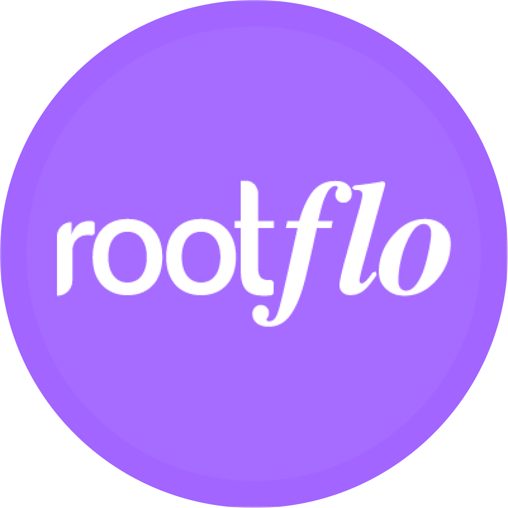

<p align="center">
  
</p>

<h1 align="center">Flo AI 🌊</h1>

<p align="center">
  <strong>Build production-ready AI agents with structured outputs, tool integration, and multi-LLM support</strong>
</p>

<p align="center">
  <a href="https://github.com/rootflo/flo-ai/stargazers"></a>
  <a href="https://github.com/rootflo/flo-ai/releases">
    
  </a>
  <a href="https://github.com/rootflo/flo-ai/graphs/commit-activity">
  </a>
  <a href="https://github.com/rootflo/flo-ai/blob/develop/LICENSE">
  </a>
  <a href="#">
  </a>
  <br/>
</p>

<p align="center">
  <br/>
   <a href="https://github.com/rootflo/flo-ai">GitHub</a>
   •
    <a href="https://rootflo.ai" target="_blank">Website</a>
   •
    <a href="https://flo-ai.rootflo.ai" target="_blank">Documentation</a>
  </p>

  <hr />

## 🚀 What is Flo AI?

Flo AI is a Python framework that makes building production-ready AI agents and teams as easy as writing YAML. Think "Kubernetes for AI Agents" - compose complex AI architectures using pre-built components while maintaining the flexibility to create your own.

### ✨ Key Features

- 🔌 **Truly Composable**: Build complex AI systems by combining smaller, reusable components
- 🏗️ **Production-Ready**: Built-in best practices and optimizations for production deployments
- 📝 **YAML-First**: Define your entire agent architecture in simple YAML
- 🧠 **LLM-Powered Routing**: Intelligent routing decisions made by LLMs, no code required
- 🔧 **Flexible**: Use pre-built components or create your own
- 🤝 **Team-Oriented**: Create and manage teams of AI agents working together
- 📊 **OpenTelemetry Integration**: Built-in observability with automatic instrumentation

## 📖 Table of Contents

- [🚀 Quick Start](#-quick-start)
  - [Installation](#installation)
  - [Your First Agent (30 seconds)](#your-first-agent-30-seconds)
  - [Tool-Using Agent](#tool-using-agent)
  - [Structured Output Agent](#structured-output-agent)
- [🎨 Flo AI Studio - Visual Workflow Designer](#-flo-ai-studio---visual-workflow-designer)
- [🔧 Core Features](#-core-features)
  - [LLM Providers](#llm-providers)
  - [Tools & @flo_tool Decorator](#tools--flo_tool-decorator)
  - [Variables System](#variables-system)
  - [Document Processing](#document-processing)
  - [Output Formatting](#output-formatting)
  - [Error Handling](#error-handling)
- [🔄 Agent Orchestration with Arium](#-agent-orchestration-with-arium)
  - [Simple Agent Chains](#simple-agent-chains)
  - [Conditional Routing](#conditional-routing)
  - [YAML-Based Workflows](#yaml-based-workflows)
  - [LLM-Powered Routers](#llm-powered-routers)
  - [ReflectionRouter & PlanExecuteRouter](#reflectionrouter--planexecuterouter)
- [📊 OpenTelemetry Integration](#-opentelemetry-integration)
- [📚 Examples & Documentation](#-examples--documentation)
- [🌟 Why Flo AI?](#-why-flo-ai)
- [🤝 Contributing](#-contributing)

## 🚀 Quick Start

### Installation

```bash
pip install flo-ai
# or using poetry
poetry add flo-ai
# or using uv
uv add flo-ai
```

### Your First Agent (30 seconds)

```python
import asyncio
from flo_ai.builder.agent_builder import AgentBuilder
from flo_ai.llm import OpenAI

async def main():
    # Create a simple conversational agent
    agent = (
        AgentBuilder()
        .with_name('Math Tutor')
        .with_prompt('You are a helpful math tutor.')
        .with_llm(OpenAI(model='gpt-4o-mini'))
        .build()
    )

    response = await agent.run('What is the formula for the area of a circle?')
    print(f'Response: {response}')

asyncio.run(main())
```

### Tool-Using Agent

```python
import asyncio
from flo_ai.builder.agent_builder import AgentBuilder
from flo_ai.tool import flo_tool
from flo_ai.llm import Anthropic

@flo_tool(description="Perform mathematical calculations")
async def calculate(operation: str, x: float, y: float) -> float:
    """Calculate mathematical operations between two numbers."""
    operations = {
        'add': lambda: x + y,
        'subtract': lambda: x - y,
        'multiply': lambda: x * y,
        'divide': lambda: x / y if y != 0 else 0,
    }
    return operations.get(operation, lambda: 0)()

async def main():
    agent = (
    AgentBuilder()
    .with_name('Calculator Assistant')
    .with_prompt('You are a math assistant that can perform calculations.')
    .with_llm(Anthropic(model='claude-3-5-sonnet-20240620'))
        .with_tools([calculate.tool])
    .build()
)

    response = await agent.run('Calculate 5 plus 3')
    print(f'Response: {response}')

asyncio.run(main())
```

### Structured Output Agent

```python
import asyncio
from pydantic import BaseModel, Field
from flo_ai.builder.agent_builder import AgentBuilder
from flo_ai.llm import OpenAI

class MathSolution(BaseModel):
    solution: str = Field(description="Step-by-step solution")
    answer: str = Field(description="Final answer")
    confidence: float = Field(description="Confidence level (0-1)")

async def main():
    agent = (
    AgentBuilder()
        .with_name('Math Solver')
    .with_llm(OpenAI(model='gpt-4o'))
        .with_output_schema(MathSolution)
    .build()
)

    response = await agent.run('Solve: 2x + 5 = 15')
    print(f'Structured Response: {response}')

asyncio.run(main())
```

## 🎨 Flo AI Studio - Visual Workflow Designer

**Create AI workflows visually with our powerful React-based studio!**

<p align="center">
  
</p>

Flo AI Studio is a modern, intuitive visual editor that allows you to design complex multi-agent workflows through a drag-and-drop interface. Build sophisticated AI systems without writing code, then export them as production-ready YAML configurations.

### 🚀 Studio Features

- **🎯 Visual Design**: Drag-and-drop interface for creating agent workflows
- **🤖 Agent Management**: Configure AI agents with different roles, models, and tools
- **🔀 Smart Routing**: Visual router configuration for intelligent workflow decisions
- **📤 YAML Export**: Export workflows as Flo AI-compatible YAML configurations
- **📥 YAML Import**: Import existing workflows for further editing
- **✅ Workflow Validation**: Real-time validation and error checking
- **🔧 Tool Integration**: Connect agents to external tools and APIs
- **📋 Template System**: Quick start with pre-built agent and router templates

### 🏃‍♂️ Quick Start with Studio

1. **Start the Studio**:

   ```bash
   cd studio
   pnpm install
   pnpm dev
   ```

2. **Design Your Workflow**:

   - Add agents, routers, and tools to the canvas
   - Configure their properties and connections
   - Test with the built-in validation

3. **Export & Run**:

```python
from flo_ai.arium import AriumBuilder

   builder = AriumBuilder.from_yaml(yaml_file='your_workflow.yaml')
   result = await builder.build_and_run(['Your input here'])
```

## 🔧 Core Features

### LLM Providers

Flo AI supports multiple LLM providers with consistent interfaces:

```python
# OpenAI
from flo_ai.llm import OpenAI
llm = OpenAI(model='gpt-4o', temperature=0.7)

# Anthropic Claude
from flo_ai.llm import Anthropic
llm = Anthropic(model='claude-3-5-sonnet-20240620', temperature=0.7)

# Google Gemini
from flo_ai.llm import Gemini
llm = Gemini(model='gemini-2.5-flash', temperature=0.7)

# Google VertexAI
from flo_ai.llm import VertexAI
llm = VertexAI(model='gemini-2.5-flash', project='your-project')

# Ollama (Local)
from flo_ai.llm import Ollama
llm = Ollama(model='llama2', base_url='http://localhost:11434')
```

### Tools & @flo_tool Decorator

Create custom tools easily with the `@flo_tool` decorator:

```python
from flo_ai.tool import flo_tool

@flo_tool(description="Get current weather for a city")
async def get_weather(city: str, country: str = None) -> str:
    """Get weather information for a specific city."""
    # Your weather API implementation
    return f"Weather in {city}: sunny, 25°C"

# Use in agent
    agent = (
        AgentBuilder()
    .with_name('Weather Assistant')
        .with_llm(OpenAI(model='gpt-4o-mini'))
    .with_tools([get_weather.tool])
        .build()
    )
```

### Variables System

Dynamic variable resolution in agent prompts using `<variable_name>` syntax:

```python
# Create agent with variables
agent = (
    AgentBuilder()
    .with_name('Data Analyst')
    .with_prompt('Analyze <dataset_path> and focus on <key_metric>. Generate insights for <target_audience>.')
    .with_llm(OpenAI(model='gpt-4o-mini'))
    .build()
)

# Define variables at runtime
variables = {
    'dataset_path': '/data/sales_q4_2024.csv',
    'key_metric': 'revenue growth',
    'target_audience': 'executive team'
}

result = await agent.run(
    'Please provide a comprehensive analysis with actionable recommendations.',
    variables=variables
)
```

### Document Processing

Process PDF and TXT documents with AI agents:

```python
from flo_ai.models.document import DocumentMessage, DocumentType

    # Create document message
    document = DocumentMessage(
        document_type=DocumentType.PDF,
        document_file_path='business_report.pdf'
    )

# Process with agent
agent = (
    AgentBuilder()
    .with_name('Document Analyzer')
    .with_prompt('Analyze the provided document and extract key insights.')
    .with_llm(OpenAI(model='gpt-4o-mini'))
    .build()
)

    result = await agent.run([document])
```

### Output Formatting

Use Pydantic models for structured outputs:

```python
from pydantic import BaseModel, Field

class AnalysisResult(BaseModel):
    summary: str = Field(description="Executive summary")
    key_findings: list = Field(description="List of key findings")
    recommendations: list = Field(description="Actionable recommendations")

agent = (
    AgentBuilder()
    .with_name('Business Analyst')
    .with_llm(OpenAI(model='gpt-4o'))
    .with_output_schema(AnalysisResult)
    .build()
)
```

### Error Handling

Built-in retry mechanisms and error recovery:

```python
agent = (
    AgentBuilder()
    .with_name('Robust Agent')
    .with_llm(OpenAI(model='gpt-4o'))
    .with_retries(3)  # Retry up to 3 times on failure
    .build()
)
```

## 🔄 Agent Orchestration with Arium

Arium is Flo AI's powerful workflow orchestration engine for creating complex multi-agent workflows.

### Simple Agent Chains

```python
from flo_ai.arium import AriumBuilder
from flo_ai.models.agent import Agent
from flo_ai.llm import OpenAI

async def simple_chain():
    llm = OpenAI(model='gpt-4o-mini')

    # Create agents
    analyst = Agent(
        name='content_analyst',
        system_prompt='Analyze the input and extract key insights.',
        llm=llm
    )

    summarizer = Agent(
        name='summarizer',
        system_prompt='Create a concise summary based on the analysis.',
        llm=llm
    )

    # Build and run workflow
    result = await (
        AriumBuilder()
        .add_agents([analyst, summarizer])
        .start_with(analyst)
        .connect(analyst, summarizer)
        .end_with(summarizer)
        .build_and_run(["Analyze this complex business report..."])
    )

    return result
```

### Conditional Routing

```python
from flo_ai.arium.memory import BaseMemory

    def route_by_type(memory: BaseMemory) -> str:
        """Route based on classification result"""
    messages = memory.get()
    last_message = str(messages[-1]) if messages else ""

        if "technical" in last_message.lower():
            return "tech_specialist"
        else:
            return "business_specialist"

    # Build workflow with conditional routing
result = await (
        AriumBuilder()
        .add_agents([classifier, tech_specialist, business_specialist, final_agent])
        .start_with(classifier)
        .add_edge(classifier, [tech_specialist, business_specialist], route_by_type)
        .connect(tech_specialist, final_agent)
        .connect(business_specialist, final_agent)
        .end_with(final_agent)
        .build_and_run(["How can we optimize our database performance?"])
    )
```

### YAML-Based Workflows

Define entire workflows in YAML:

```yaml
metadata:
  name: "content-analysis-workflow"
  version: "1.0.0"
  description: "Multi-agent content analysis pipeline"

arium:
  agents:
    - name: "analyzer"
      role: "Content Analyst"
      job: "Analyze the input content and extract key insights."
      model:
        provider: "openai"
        name: "gpt-4o-mini"

    - name: "summarizer"
      role: "Content Summarizer"
      job: "Create a concise summary based on the analysis."
      model:
        provider: "anthropic"
        name: "claude-3-5-sonnet-20240620"

  workflow:
    start: "analyzer"
    edges:
      - from: "analyzer"
        to: ["summarizer"]
    end: ["summarizer"]
```

```python
# Run YAML workflow
result = await (
        AriumBuilder()
    .from_yaml(yaml_str=workflow_yaml)
        .build_and_run(["Analyze this quarterly business report..."])
    )
```

### LLM-Powered Routers

Define intelligent routing logic directly in YAML:

```yaml
  routers:
    - name: "content_type_router"
    type: "smart"  # Uses LLM for intelligent routing
      routing_options:
      technical_writer: "Technical content, documentation, tutorials"
      creative_writer: "Creative writing, storytelling, fiction"
      marketing_writer: "Marketing copy, sales content, campaigns"
      model:
        provider: "openai"
        name: "gpt-4o-mini"
```

### ReflectionRouter & PlanExecuteRouter

**ReflectionRouter** for A→B→A→C feedback patterns:

```yaml
  routers:
    - name: "reflection_router"
    type: "reflection"
      flow_pattern: [writer, critic, writer]  # A → B → A pattern
      model:
        provider: "openai"
        name: "gpt-4o-mini"
```

**PlanExecuteRouter** for Cursor-style plan-and-execute workflows:

```yaml
routers:
  - name: "plan_router"
    type: "plan_execute"
  agents:
      planner: "Creates detailed execution plans"
      developer: "Implements features according to plan"
        tester: "Tests implementations and validates functionality"
        reviewer: "Reviews and approves completed work"
      settings:
        planner_agent: planner
      executor_agent: developer
        reviewer_agent: reviewer
```

## 📊 OpenTelemetry Integration

Built-in observability for production monitoring:

```python
from flo_ai import configure_telemetry, shutdown_telemetry

# Configure at startup
configure_telemetry(
    service_name="my_ai_app",
    service_version="1.0.0",
    console_export=True  # For debugging
)

# Your application code here...

# Shutdown to flush data
shutdown_telemetry()
```

**📖 [Complete Telemetry Guide →](flo_ai/flo_ai/telemetry/README.md)**

## 📚 Examples & Documentation

### Examples Directory

Check out the `examples/` directory for comprehensive examples:

- `agent_builder_usage.py` - Basic agent creation patterns
- `yaml_agent_example.py` - YAML-based agent configuration
- `output_formatter.py` - Structured output examples
- `multi_tool_example.py` - Multi-tool agent examples
- `document_processing_example.py` - Document processing with PDF and TXT files

### Documentation

Visit our [website](https://www.rootflo.ai) to know more

**Additional Resources:**

- [@flo_tool Decorator Guide](TOOLS.md) - Complete guide to the `@flo_tool` decorator
- [Examples Directory](flo_ai/examples/) - Ready-to-run code examples
- [Contributing Guide](CONTRIBUTING.md) - How to contribute to Flo AI

## 🌟 Why Flo AI?

### For Developers

- **Simple Setup**: Get started in minutes with minimal configuration
- **Flexible**: Use YAML or code-based configuration
- **Production Ready**: Built-in error handling and retry mechanisms
- **Multi-LLM**: Switch between providers easily

### For Teams

- **Maintainable**: YAML-first approach makes configurations versionable
- **Testable**: Each component can be tested independently
- **Scalable**: From simple agents to complex multi-tool systems

### Use Cases

- 🤖 Customer Service Automation
- 📊 Data Analysis and Processing
- 📝 Content Generation and Summarization
- 🔍 Research and Information Retrieval
- 🎯 Task-Specific AI Assistants
- 📧 Email Analysis and Classification

## 🤝 Contributing

We love your input! Check out our [Contributing Guide](CONTRIBUTING.md) to get started. Ways to contribute:

- 🐛 Report bugs
- 💡 Propose new features
- 📝 Improve documentation
- 🔧 Submit PRs

## 📜 License

Flo AI is [MIT Licensed](LICENSE).

---

<div align="center">
  <strong>Built with ❤️ by the <a href="http://rootflo.ai">rootflo</a> team</strong>
  <br><a href="https://github.com/rootflo/flo-ai/discussions">Community</a> •
  <a href="https://flo-ai.rootflo.ai">Documentation</a>
</div>
