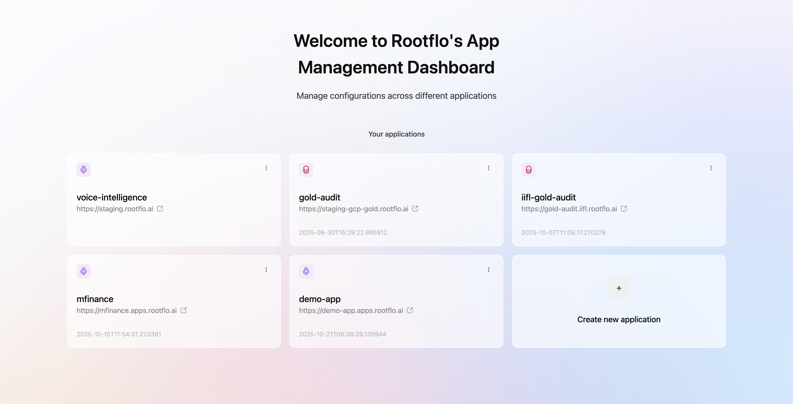
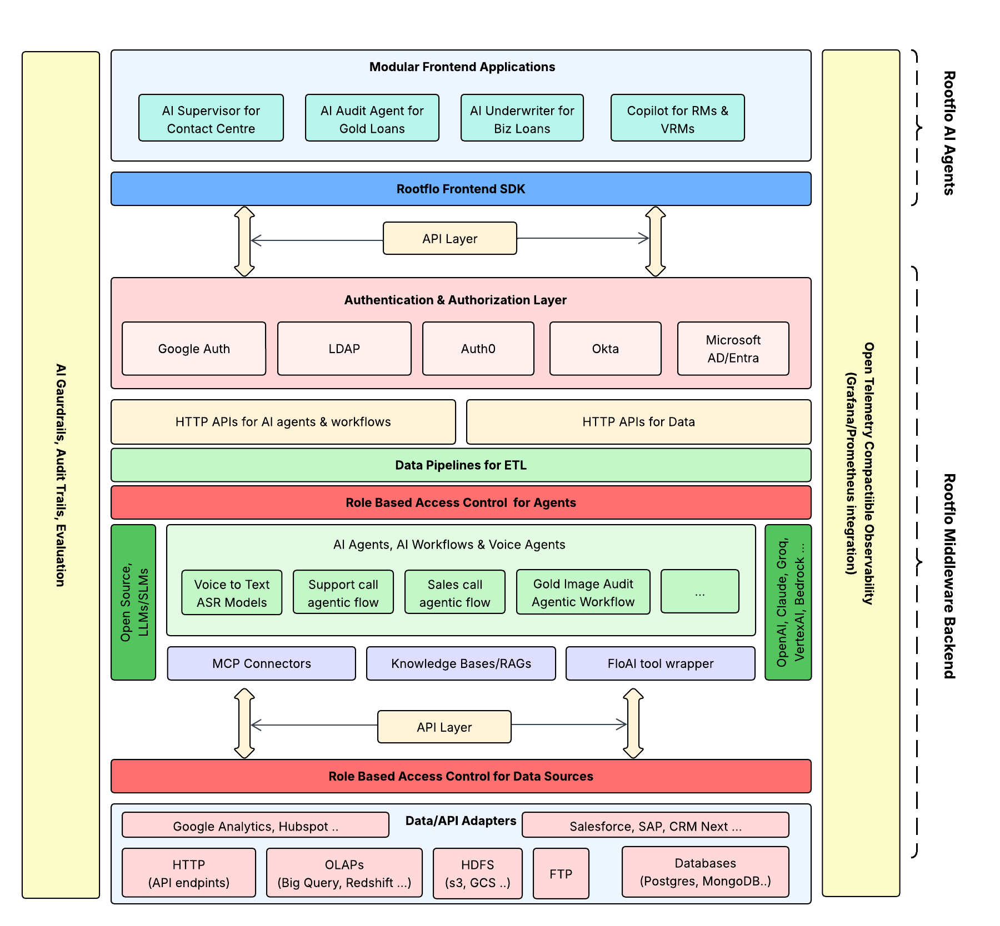

  

  presents

<h1 align="center">OneFabric</h1>
<h2 align="center">Enterprise AI Middleware For Building Production Ready Full Stack Applications</h1>
<h3 align="center">Open source alternative to UnifyApps, LyzrAI, SuperAGI & AgentGPT</h2>

<a href="https://github.com/rootflo/flo-ai/tree/develop/flo_ai">Built using flo-ai</a>

  
  
  
  </a>
  
   

   
   <a href="https://github.com/rootflo/flo-ai">GitHub</a>
   •
    <a href="https://rootflo.ai" target="_blank">Website</a>
   •
    <a href="https://flo-ai.rootflo.ai" target="_blank">Documentation</a>
  

  

# 🚀 OFabric AI Middleware

OFabric AI is an open-source middleware platform designed to seamlessly integrate AI-driven agents, workflows, and data sources across enterprise environments. It acts as a connective layer that bridges modular frontend applications with complex backend data pipelines, ensuring secure access, observability, and compatibility with modern AI and data infrastructures.

**Status**: Pre-release (Open sourcing coming soon)  
**OFabric License**: GNU AFFERO GENERAL PUBLIC LICENSE 3.0  
**FloAI License**: MIT LICENSE
**Contributing**: We welcome early feedback! See [CONTRIBUTING.md](CONTRIBUTING.md)

  

---

## ✨ Key Capabilities

- **🎯 Modular AI Application Integration**  
  Deploy diverse AI agents for auditing, underwriting, contact center supervision, and business process automation without rebuilding infrastructure.

- **🔌 Unified SDK and API Layer**  
  Standardized APIs for developing, deploying, and managing AI workflows across multiple use cases and frameworks.

- **🔐 Enterprise-Grade Authentication & Authorization**  
  Native integrations with Google Auth, LDAP, Auth0, Okta, and Microsoft AD/Entra for seamless SSO and access controls.

- **🌐 Comprehensive Data Connectivity**  
  Ingest data from OLAP/OLTP systems (BigQuery, Redshift), HDFS, cloud storage (S3, GCS), databases (PostgreSQL, MongoDB), and enterprise APIs (Salesforce, SAP).

- **👥 Granular Role-Based Access Control**  
  Fine-grained permissions for both AI agents and data sources, ensuring compliance and least-privilege access.

- **🤖 Open Source & Proprietary Model Support**  
  Works seamlessly with open-source LLMs/SLMs, custom models, and proprietary AI services.

- **📊 Observability, Monitoring & Evaluation**  
  Built-in telemetry with Grafana and Prometheus support. Track agent performance, audit trails, and guardrail enforcement in real-time.

- **🤖 No Code Agent & Workflow Builder**
  Built-in capabilities to build and customer AI agents, and AI Workflows, connecting Data Sources, Knowledge Bases, in minutes

- **🔊 Voice & Conversational Agents**  
  Integrated Voice-to-Voice Bots, ASR models, and agentic flows for contact center and conversational use cases.

- **🧠 Knowledge Bases & RAG Ready**  
  Native support for Retrieval-Augmented Generation with MCP connectors and external knowledge bases.

---

## 🏗️ Architecture Overview

  

### Layer Descriptions

| Layer | Purpose | Components |
|-------|---------|------------|
| **Frontend Applications** | User-facing AI interfaces | Supervisors, Audit Agents, Underwriters, Copilots |
| **SDK & API Layer** | Standardized communication | Frontend SDK, REST/GraphQL APIs |
| **Authentication** | Identity verification & SSO | Google Auth, LDAP, Auth0, Okta, Microsoft AD |
| **Authorization (Agents)** | Agent-level access policies | Role definitions, permission mapping |
| **AI Workflows** | Intelligent automation | Agentic flows, Voice agents, LLM integrations, RAG |
| **Data Processing** | ETL and API management | Pipelines, transformations, HTTP endpoints |
| **Authorization (Data)** | Data source access control | Fine-grained permissions, audit logging |
| **Data Sources** | Enterprise data systems | Databases, APIs, Cloud storage, Data warehouses |

## Platform Components

As part of the project, we plan to develop and open source the following major components.

- [FloAI](https://github.com/rootflo/flo-ai/tree/develop/flo_ai) library for Agent Building & A2A Orchestraction
- **OFabric Core** Middleware Service
- **OFabric Control Panel** Unified frontend for configuring agents, workflows, AI models, Gaurdrails, RBAC etc.
- **OFabric cli** for configuring through cli

## 🛣️ Current Support & Roadmap

### Data Adapters

| Adapter | Status | Notes |
|---------|--------|-------|
| BigQuery | ✅ Available | Full read/write support |
| Redshift | ✅ Available | Production-ready |
| PostgreSQL | 🔄 In Progress | Optimized for large datasets |
| MySQL | 📋 Roadmap | Compatible with MySQL 5.7+ |

### API Adapters

| Adapter | Status | Notes |
|---------|--------|-------|
| Custom API Configuration | 🔄 In Progress | Flexible HTTP endpoint support |
| Salesforce | 🔄 In Progress | Native API integration |

### LLM Connectors

| Model/Service | Status | Notes |
|---------------|--------|-------|
| OpenAI | ✅ Available | GPT-3.5, GPT-4 support |
| Anthropic | ✅ Available | Claude models supported |
| vLLM (Open-Source) | ✅ Available | Self-hosted inference |
| Ollama | ✅ Available | Local model deployment |
| GroqAI | 🔄 In Progress | Fast inference support |
| Vertex AI | ✅ Available | Google Cloud integration |
| Bedrock | 🔄 In Progress | AWS integration coming soon |

### Authentication Providers

| Provider | Status | Notes |
|----------|--------|-------|
| Google Auth | ✅ Available | OAuth 2.0 support |
| Microsoft AD/Entra | ✅ Available | Enterprise SSO ready |
| Okta | 📋 Roadmap | Q1 2026 |
| SAML 2.0 | 📋 Roadmap | Q1 2026 |

### Audit & Observability

| Feature | Status | Notes |
|---------|--------|-------|
| Application Metrics | ✅ Available | Prometheus-compatible |
| Application Logs | ✅ Available | Structured logging |
| AI Token Tracking | ✅ Available | Token tracking per agent |
| Open Telemetry | ✅ Available | Full OTel support |
| AI Audit Logging | 🔄 In Progress | Detailed decision trails (Q4 2025) |
| AI Guardrails | 📋 Roadmap | Policy enforcement (Q1 2026) |

### Frontend SDK

| Feature | Status | Notes |
|---------|--------|-------|
| Component Library | ✅ Available | React components ready |
| AI-Based No-Code Builder | 📋 Roadmap | Visual agent creation (Q1 2026) |
| Low Code AI Agent Builder | ✅ Available | YAML based builder available |

### Release Timeline

| Quarter | Milestone | Features |
|---------|-----------|----------|
| **Nov 2025** | Public README.md | Publish readme and take in community feedback |
| **Dec 2025** | Open-source community edition | Community edition release with working MVP |
| **Q1 2026** | Enterprise Edition | Advanced RBAC, More Data source Integrations|
| **Q1 2026** | Rootflo OFabric Cloud | One click deployable OFabric Cloud
| **Q2 2026** | Advanced Features |  No-Code App Builder, Advanced Analytics & Dashboards |

See [ROADMAP.md](ROADMAP.md) for detailed feature plans and contribution opportunities.

---

## 🤝 Contributing

We welcome contributions from the community! Whether it's bug reports, feature requests, or code contributions:

1. Fork the repository
2. Create a feature branch (`git checkout -b feature/amazing-feature`)
3. Commit your changes (`git commit -m 'Add amazing feature'`)
4. Push to the branch (`git push origin feature/amazing-feature`)
5. Open a Pull Request

See [CONTRIBUTING.md](CONTRIBUTING.md) for detailed guidelines.

---

## 🙏 Acknowledgments

OFabric AI was built with inspiration from leading open-source projects in the AI infrastructure space. Special thanks to our early adopters and community contributors.

---

## ⭐ Show Your Support

If you find OFabric AI useful, please consider:

- Starring this repository ⭐
- Sharing with your network
- Contributing to the project
- Providing feedback and feature requests

---

**Ready to transform your enterprise AI infrastructure?** Get started with [OFabric AI today](GETTING_STARTED.md).

