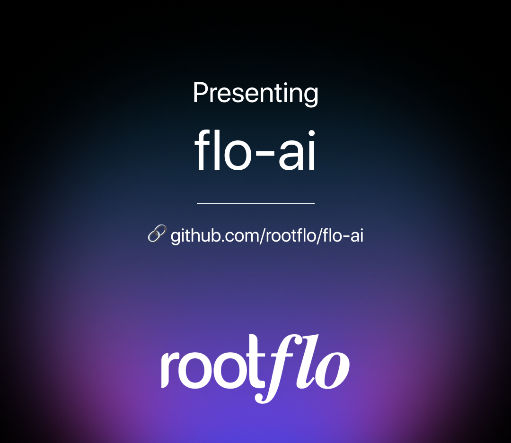
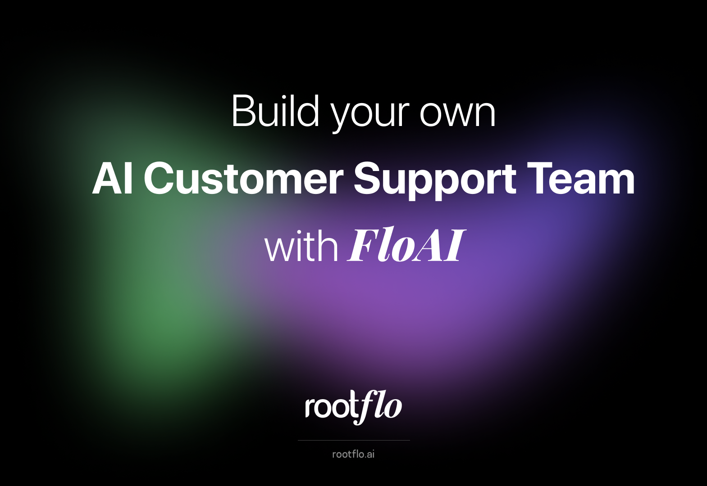
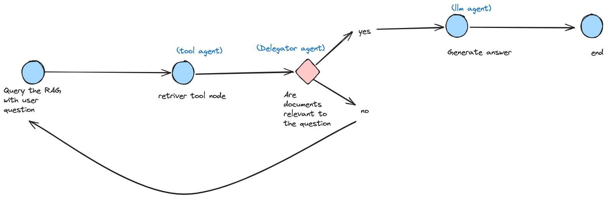

<p align="center">
  
</p>

<h1 align="center">Composable AI Agentic Workflow</h1>

<p align="center">
Rootflo is an alternative to <b>Langgraph</b>, and  <b>CrewAI</b>. It lets you easily build composable agentic workflows from using simple components to any size, unlocking the full potential of LLMs.
</p>

<p align="center">
  <a href="https://github.com/rootflo/flo-ai/stargazers"></a>
  <a href="https://github.com/rootflo/flo-ai/releases">
    
  </a>
  <a href="https://github.com/rootflo/flo-ai/graphs/commit-activity">
  </a>
  <a href="https://github.com/rootflo/flo-ai/blob/develop/LICENSE">
  </a>
  <br/>
</p>

<p align="center">
  <br/>
  <a href="https://flo-ai.rootflo.ai" rel="" target="_blank"><strong>Checkout the docs »</strong></a>
  <br/>
  <br/>
   <a href="https://github.com/rootflo/flo-ai">Github</a>
   •
    <a href="https://rootflo.ai" target="_blank">Website</a>
   •
    <a href="https://github.com/rootflo/flo-ai/blob/develop/ROADMAP.md" target="_blank">Roadmap</a>
  </p>

  <hr />

# Flo AI 🌊

> Build production-ready AI agents and teams with minimal code

Flo AI is a Python framework that makes building production-ready AI agents and teams as easy as writing YAML. Think "Kubernetes for AI Agents" - compose complex AI architectures using pre-built components while maintaining the flexibility to create your own.

## ✨ Features

- 🔌 **Truly Composable**: Build complex AI systems by combining smaller, reusable components
- 🏗️ **Production-Ready**: Built-in best practices and optimizations for production deployments
- 📝 **YAML-First**: Define your entire agent architecture in simple YAML
- 🔧 **Flexible**: Use pre-built components or create your own
- 🤝 **Team-Oriented**: Create and manage teams of AI agents working together
- 📚 **RAG Support**: Built-in support for Retrieval-Augmented Generation
- 🔄 **Langchain Compatible**: Works with all your favorite Langchain tools

## 🚀 Quick Start

FloAI follows an agent team architecture, where agents are the basic building blocks, and teams can have multiple agents and teams themselves can be part of bigger teams.

Building a working agent or team involves 3 steps:
1. Create a session using `FloSession`, and register your tools and models
2. Define you agent/team/team of teams using yaml or code
3. Build and run using `Flo`

### Installation

```bash
pip install flo-ai
# or using poetry
poetry add flo-ai
```

### Create Your First AI Agent in 30 secs

```python
from flo_ai import Flo, FloSession
from langchain_openai import ChatOpenAI
from langchain_community.tools.tavily_search.tool import TavilySearchResults

# init your LLM
llm = ChatOpenAI(temperature=0)

# create a session and register your tools
session = FloSession(llm).register_tool(name="TavilySearchResults", tool=TavilySearchResults())

# define your agent yaml
simple_weather_checking_agent = """
apiVersion: flo/alpha-v1
kind: FloAgent
name: weather-assistant
agent:
    name: WeatherAssistant
    job: >
      Given the city name you are capable of answering the latest whether this time of the year by searching the internet
    tools:
      - name: InternetSearchTool
"""
flo = Flo.build(session, yaml=simple_weather_checking_agent)

# Start streaming results
for response in flo.stream("Write about recent AI developments"):
    print(response)
```

## Lets create the same agent using code

```python
from flo_ai import FloAgent

session = FloSession(llm)

weather_agent = FloAgent.create(
    session=session,
    name="WeatherAssistant",
    job="Given the city name you are capable of answering the latest whether this time of the year by searching the internet",
    tools=[TavilySearchResults()]
)

agent_flo: Flo = Flo.create(session, weather_agent)
result = agent_flo.invoke("Whats the whether in New Delhi, India ?")
```

### Create Your First AI Team in 30 Seconds

```python
from flo_ai import Flo, FloSession
from langchain_openai import ChatOpenAI
from langchain_community.tools.tavily_search.tool import TavilySearchResults


# Define your team in YAML
yaml_config = """
apiVersion: flo/alpha-v1
kind: FloRoutedTeam
name: research-team
team:
    name: ResearchTeam
    router:
        name: TeamLead
        kind: supervisor
    agents:
      - name: Researcher
        role: Research Specialist
        job: Research latest information on given topics
        tools:
          - name: TavilySearchResults
      - name: Writer
        role: Content Creator
        job: Create engaging content from research
"""

# Set up and run
llm = ChatOpenAI(temperature=0)
session = FloSession(llm).register_tool(name="TavilySearchResults", tool=TavilySearchResults())
flo = Flo.build(session, yaml=yaml_config)

# Start streaming results
for response in flo.stream("Write about recent AI developments"):
    print(response)
```

**Note:** You can make each of the above agents including the router to use different models, giving flexibility to combine the power of different LLMs.
To know more, check multi-model integration in detailed [documentation](https://flo-ai.rootflo.ai/advanced/model-switching)

### Lets Create a AI team using code

```python
from flo_ai import FloSupervisor, FloAgent, FloSession, FloTeam, FloLinear
from langchain_openai import ChatOpenAI
from langchain_community.tools.tavily_search.tool import TavilySearchResults

llm = ChatOpenAI(temperature=0, model_name='gpt-4o')
session = FloSession(llm).register_tool(
    name="TavilySearchResults",
    tool=TavilySearchResults()
)

researcher = FloAgent.create(
    session,
    name="Researcher", 
    role="Internet Researcher", # optional
    job="Do a research on the internet and find articles of relevent to the topic asked by the user", 
    tools=[TavilySearchResults()]
)

blogger = FloAgent.create(
    session, 
    name="BlogWriter", 
    role="Thought Leader", # optional
    job="Able to write a blog using information provided", 
    tools=[TavilySearchResults()]
)

marketing_team = FloTeam.create(session, "Marketing", [researcher, blogger])
head_of_marketing = FloSupervisor.create(session, "Head-of-Marketing", marketing_team)
marketing_flo = Flo.create(session, routed_team=head_of_marketing)

```

## Tools

FloAI supports all the tools built and available in `langchain_community` package. To know more these tools, go [here](https://python.langchain.com/docs/integrations/tools/).

Along with that FloAI has a decorator `@flotool` which makes any function into a tool. 

Creating a simple tool using `@flotool`:

```python
from flo_ai.tools import flotool
from pydantic import BaseModel, Field

# define argument schema
class AdditionToolInput(BaseModel):
    numbers: List[int] = Field(..., description='List of numbers to add')

@flotool(name='AdditionTool', description='Tool to add numbers')
async def addition_tool(numbers: List[int]) -> str:
    result = sum(numbers)
    await asyncio.sleep(1)
    return f'The sum is {result}'

# async tools can also be defined
# when using async tool, while running the flo use async invoke
@flotool(
    name='MultiplicationTool',
    description='Tool to multiply numbers to get product of numbers',
)
async def mul_tool(numbers: List[int]) -> str:
    result = sum(numbers)
    await asyncio.sleep(1)
    return f'The product is {result}'

# register your tool or use directly in code impl
session.register_tool(name='Adder', tool=addition_tool)
```

**Note:** `@flotool` comes with inherent error handling capabilities to retry if an exception is thrown. Use `unsafe=True` to disable error handling

## Output Parsing and formatting

FloAI now supports output parsing using JSON or YAML formatter. You can now defined your output formatter using `pydantic` and use the same in code or directly make it part of the Agent Definition Yaml (ADY)

### Using Agent Defintion YAML

We have added parser key to your agent schema, which gives you the output. The following is the schema of the parser

```yaml
name: SchemaName
fields:
  - name: field_name
    type: data_type
    description: field_description
    values: <optional(for literals, all possible values that can be taken)>
      - value: <the value>
        description: value_description
```

### Supported Field Types

#### Primitive Types

- str: String values
- int: Integer values
- bool: Boolean values
- float: Floating-point values

##### Complex Types

- array: Lists of items
- object: Nested objects
- literal: Enumerated values


Here an example of a simple summarization agent yaml that produces output a structured manner.

```yaml
apiVersion: flo/alpha-v1
kind: FloAgent
name: SummarizationFlo
agent:
  name: SummaryAgent
  kind: llm
  role: Book summarizer agent
  job: >
    You are an given a paragraph from a book
    and your job is to understand the information in it and extract summary
  parser:
    name: BookSummary
    fields:
      - name: long_summary
        type: str
        description: A comprehensive summary of the book, with all the major topics discussed
      - name: short_summary
        type: str
        description: A short summary of the book in less than 20 words
```

As you can see here, the `parser` key makes sure that output of this agent will be the given key value format.

### Using parser with code

You can define parser as json in code and use it easily, here is an example:

```python
format = {
    'name': 'NameFormat',
    'fields': [
        {
            'type': 'str',
            'description': 'The first name of the person',
            'name': 'first_name',
        },
        {
            'type': 'str',
            'description': 'The middle name of the person',
            'name': 'middle_name',
        },
        {
            'type': 'literal',
            'description': 'The last name of the person, the value can be either of Vishnu or Satis',
            'name': 'last_name',
            'values': [
                {'value': 'Vishnu', 'description': 'If the first_name starts with K'},
                {'value': 'Satis', 'description': 'If the first_name starts with M'},
            ],
            'default_value_prompt': 'If none of the above value is suited, please use value other than the above in snake-case',
        },
    ],
}

researcher = FloAgent.create(
    session,
    name='Researcher',
    role='Internet Researcher',
    job='What is the first name, last name  and middle name of the the person user asks about',
    tools=[TavilySearchResults()],
    parser=FloJsonParser.create(json_dict=format)
)


Flo.set_log_level('DEBUG')
flo: Flo = Flo.create(session, researcher)
result = flo.invoke('Mahatma Gandhi')

```

## Output Data Collector

Output collector is an infrastructure that helps you collect outputs across multiple agents into single data structure. The most useful collector is a JSON output collector which when combined with output parser gives combined JSON outputs.

Usage:
```python
from flo_ai.state import FloJsonOutputCollector

dc = FloJsonOutputCollector()

# register your collector to the session
session = FloSession(llm).register_tool(
    name='InternetSearchTool', tool=TavilySearchResults()
)

simple_reseacher = """
apiVersion: flo/alpha-v1
kind: FloAgent
name: weather-assistant
agent:
    name: WeatherAssistant
    kind: agentic
    job: >
      Given the person name, guess the first and last name
    tools:
      - name: InternetSearchTool
    parser:
        name: NameFormatter
        fields:
            - type: str
              description: The first name of the person
              name: first_name
            - type: str
              description: The first name of the person
              name: last_name
            - name: location 
              type: object
              description: The details about birth location
              fields: 
                - name: state
                  type: str
                  description: The Indian State in whihc the person was born
    data_collector: kv
"""

flo: Flo = Flo.build(session, simple_reseacher)
result = flo.invoke('Gandhi')

# This will output the output as JSON. The idea is that you can use the same collector across multiple agents and teams to still get a combined JSON output.
print(dc.fetch())

```

## 📊 Tool Logging and Data Collection

FloAI provides built-in capabilities for logging tool calls and collecting data through the `FloExecutionLogger` and `DataCollector` classes, facilitating the creation of valuable training data.
You can customize `DataCollector` implementation according to your database. A sample implementation where logs are stored locally as JSON files is implemented in `JSONLFileCollector`.

### Quick Setup

```python
from flo_ai.callbacks import FloExecutionLogger
from flo_ai.storage.data_collector import JSONLFileCollector

# Initialize the file collector with a path for the JSONL log file to be stored
file_collector = JSONLFileCollector("'.logs'")

# Create a tool logger with the collector
local_tracker = FloExecutionLogger(file_collector)

# Register the logger with your session
session.register_callback(local_tracker)
```

### Features

- 📝 Logs all tool calls, chain executions, and agent actions
- 🕒 Includes timestamps for start and end of operations
- 🔍 Tracks inputs, outputs, and errors
- 💾 Stores data in JSONL format for easy analysis
- 📚 Facilitates the creation of training data from logged interactions

### Log Data Structure

The logger captures detailed information including:
- Tool name and inputs
- Execution timestamps
- Operation status (completed/error)
- Chain and agent activities
- Parent-child relationship between operations

### Training Data Generation

The structured logs provide valuable training data that can be used to:
- **Fine-tune LLMs** on your specific use cases
- **Train new models** to replicate successful tool usage patterns
- **Create supervised datasets** for tool selection and chain optimization

We have created a script to convert your logs to training data:

```python
python generate_training_data.py --logger-path PATH --tool-path PATH [--output PATH]
```

Arguments:
- *logger-path*: Path to the logger file containing tool and chain entries, eg: .logs/logs/log.jsonl
- *tool-path*: Path to the tool descriptions file eg: eg: .logs/tools/tools.jsonl
- *output*: path to save the output eg: training-data.jsonl
 

## 📖 Documentation

Visit our [comprehensive documentation](https://flo-ai.rootflo.ai) for:
- Detailed tutorials
- Architecture deep-dives
- API reference
  - Logging
  - Error handling
  - Observers
  - Dynamic model switching
- Best practices
- Advanced examples

## 🌟 Why Flo AI?

### For AI Engineers
- **Faster Development**: Build complex AI systems in minutes, not days
- **Production Focus**: Built-in optimizations and best practices
- **Flexibility**: Use our components or build your own

### For Teams
- **Maintainable**: YAML-first approach makes systems easy to understand and modify
- **Scalable**: From single agents to complex team hierarchies
- **Testable**: Each component can be tested independently

## 🎯 Use Cases

- 🤖 Customer Service Automation
- 📊 Data Analysis Pipelines
- 📝 Content Generation
- 🔍 Research Automation
- 🎯 Task-Specific AI Teams

## 🤝 Contributing

We love your input! Check out our [Contributing Guide](CONTRIBUTING.md) to get started. Ways to contribute:

- 🐛 Report bugs
- 💡 Propose new features
- 📝 Improve documentation
- 🔧 Submit PRs

## 📜 License

Flo AI is [MIT Licensed](LICENSE).

## 🙏 Acknowledgments

Built with ❤️ using:
- [LangChain](https://github.com/hwchase17/langchain)
- [LangGraph](https://github.com/langchain-ai/langgraph)

<h2>📚 Latest Blog Posts</h2>

<div style="display: flex; gap: 10px;">
    <a href="https://medium.com/rootflo/flo-simple-way-to-create-composable-ai-agents-6946c2922a94" target="_blank" style="text-decoration: none;">
        
        <p><b>Flo: 🔥🔥🔥 Simple way to create composable AI agents</b><br />Unlock the Power of Customizable AI Workflows with FloAI’s Intuitive and Flexible Agentic Framework</p>
    </a>
    <a href="https://medium.com/rootflo/build-an-agentic-ai-customer-support-bot-using-floai-533660fb9c9b" target="_blank" style="text-decoration: none;">
        
        <p><b>Build an Agentic AI customer support bot using FloAI</b><br />We built an open-source agentic AI workflow builder named FloAI and used it to create an agentic customer support agent.</p>
    </a>
    <a href="https://medium.com/rootflo/build-an-agentic-rag-using-floai-in-minutes-0be260304c98" target="_blank" style="text-decoration: none;">
        
        <p><b>Build an Agentic RAG using FloAI in minutes</b><br />FloAI has just made implementing agentic RAG simple and easy to manage</p>
    </a>
</div>
    <a href="https://medium.com/rootflo/mastering-ai-interaction-logging-and-data-collection-with-floai-a490818bb2f1" target="_blank" style="text-decoration: none;">
        
        <p><b>Mastering AI Interaction Logging and Data Collection with FloAI</b><br />Learn how to leverage FloAI's powerful logging system for debugging, training data generation, and system optimization</p>
    </a>
    </a>
---

<div align="center">
  <strong>Built with ❤️ by the <a href="http://rootflo.ai">rootflo</a> team</strong>
  <br><a href="https://github.com/rootflo/flo-ai/discussions">Community</a> •
  <a href="https://flo-ai.rootflo.ai">Documentation</a>
</div>
