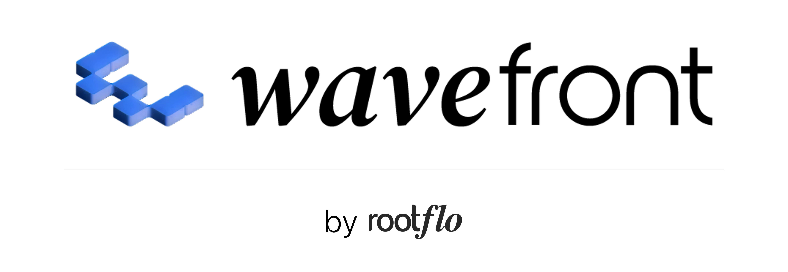
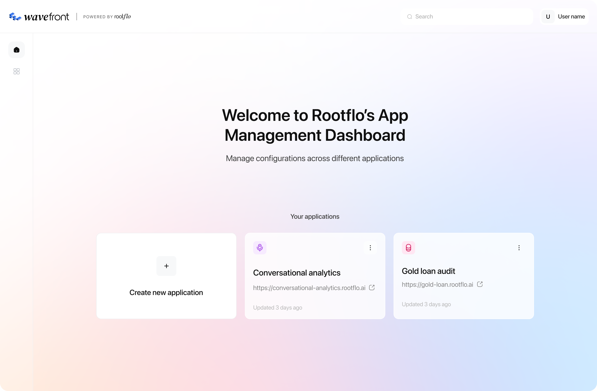

  

<h2 align="center">Enterprise AI Middleware For Building Production Ready AI Applications</h1>
<h3 align="center">Open source alternative to UnifyApps, LyzrAI, SuperAGI & AgentGPT</h3>
<h4 align="center">Alternative to n8n, for building enterprise grade AI workflows</h4>

  
  
  
  
   

   
   <a href="https://github.com/rootflo/flo-ai">GitHub</a>
   •
    <a href="https://rootflo.ai" target="_blank">Website</a>
   •
    <a href="https://flo-ai.rootflo.ai" target="_blank">Documentation</a>
   •
    <a href="https://discord.gg/BPXsNwfuRU" target="_blank">Discord</a>
  

  

  
   
  ✨ <i>Powered by the flo-ai framework</i> ✨

  

## What is Wavefront ?

Wavefront AI is an open-source middleware platform designed to:
- Seamlessly connect to any API, database or file storage system
- Connect to any LLM or SLM
- Build AI-driven agents, workflows, and automations across enterprise by connecting to multiple data sources, knowledge bases, and services
- Provide authentication, authorization, observability, monitoring & evaluation for all agents & workflows

## What people build with Wavefront ?
- To build AI agents & workflows to audit, underwrite, supervise contact center, and automate business processes
- To build knowledge bases & RAG ready applications for internal enterprise use
- To build voice & conversational agents collections and sales use-cases
- To build AI workflows to connect multiple data sources, knowledge bases, and services

  

| Project Information | Details |
|-----------|------------|
|**Release Status** | Beta Release| 
|**Wavefront License** | GNU AFFERO GENERAL PUBLIC LICENSE 3.0 |
|**FloAI License** | MIT LICENSE |

## ✨ Key Capabilities

- **🔌 Unified API Layer**  
  Standardized APIs for developing, deploying, and managing AI workflows & agents across multiple use cases and frameworks.

- **🔐 Enterprise-Grade Authentication & Authorization**  
  Native integrations with Google Auth and Microsoft AD/Entra for seamless SSO and access controls for client applications

- **🌐 Comprehensive Data Connectivity**  
  Ingest data from OLAP/OLTP systems (BigQuery, Redshift), HDFS, cloud storage (S3, GCS), databases (PostgreSQL, MongoDB), and enterprise APIs (Salesforce, SAP).

- **👥 Granular Role-Based Access Control**  
  Fine-grained permissions for both AI agents and data sources, ensuring compliance and least-privilege access.

- **🤖 Open Source & Proprietary Model Support**  
  Works seamlessly with open-source LLMs/SLMs, custom models, and proprietary AI services.

- **📊 Observability, Monitoring & Evaluation**  
  Built-in OpenTelemetry telemetry pushed to any APM backend — local Jaeger, Azure Application Insights, AWS X-Ray/CloudWatch, GCP Cloud Trace, or any OTLP-compatible vendor. Track agent performance, audit trails, and guardrail enforcement in real-time.

- **🤖 No Code Agent & Workflow Builder**
  Built-in capabilities to build and customize AI agents, and AI Workflows, connecting Data Sources, Knowledge Bases, in minutes

- **🔊 Voice & Conversational Agents**  
  Integrated Voice-to-Voice Bots, ASR models, and agentic flows for contact center and conversational use cases.

- **🧠 Knowledge Bases & RAG Ready**  
  Native support for Retrieval-Augmented Generation with MCP connectors and external knowledge bases.

- **🎯 Modular AI Application Integration (Coming Soon)**  
Deploy diverse AI agents for auditing, underwriting, contact center supervision, and business process automation without rebuilding infrastructure.

## Quick Start

**Option 1**: [Schedule a demo](https://calendly.com/meetings-rootflo/30min) and we help you build immediately. 

**Option 2**: Self-host for maximum control and customization. Please find the self-hosting instructions in the [Wavefront Documentation](https://github.com/rootflo/wavefront/tree/develop/wavefront).

## Platform Components

As part of the project, we are building the following components

| Component | Description |
|---------|-------------|
| **flo-ai** | [FloAI](https://github.com/rootflo/flo-ai/tree/develop/flo_ai) library for Agent Building & A2A Orchestration. Detailed documentation is available [here](https://wavefront.rootflo.ai/flo-ai). |
| **wavefront-server** | Core Middleware Service, which connects everything and orchestrates the flows. Detailed documentation is available [here](https://github.com/rootflo/wavefront/tree/develop/wavefront). |
| **wavefront-client** | Unified frontend for configuring agents, workflows, AI models, Guardrails developer-friendly, RBAC etc. Details [here](https://github.com/rootflo/wavefront/tree/develop/wavefront). |
| **wavefront-cli** | for configuring through cli, for full developer-friendly control (**Coming Soon**) |

## Release Timeline

| Quarter | Milestone | Features |
|---------|-----------|----------|
| **Nov 2025** | Public README.md | Publish readme and take in community feedback |
| **Dec 2025** | Open-source Beta Release | Beta with basic features |
| **Q1 2026** | GA Release | Advanced RBAC, More Data source Integrations|
| **Q1 2026** | Rootflo Wavefront Cloud | Multi-tenant Cloud offering |

See [ROADMAP.md](ROADMAP.md) for detailed feature plans and contribution opportunities.

> [!WARNING]
> 
> - This project is under active development and APIs may change without notice. Please checkout the [platform docs](https://wavefront.rootflo.ai) for the latest information.
> - The platform is not in the GA state, and there are unimplemented feature. Checkout [ROADMAP.md](../ROADMAP.md) for the list of features, and whats missing.

## ⭐ Show Your Support

If you find Wavefront AI useful, please consider:

- Starring this repository ⭐
- Sharing with your network
- Contributing to the project
- Providing feedback and feature requests

---

## Next Steps

- [Join our Discord](https://discord.gg/BPXsNwfuRU)
- [Read our docs](https://wavefront.rootflo.ai/)
- [Submit an issue](https://github.com/rootflo/wavefront/issues/new/choose)
- [Talk to us](https://calendly.com/meetings-rootflo/30min)

Text us!  

