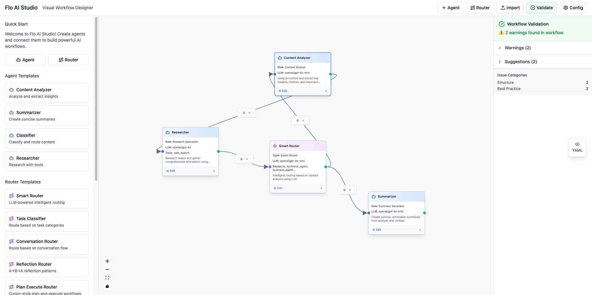

<p align="center">
  
</p>

<h1 align="center">Composable Agentic AI Workflow</h1>

<p align="center">
Flo AI is a Python framework for building structured AI agents with support for multiple LLM providers, tool integration, and YAML-based configuration. Create production-ready AI agents with minimal code and maximum flexibility.
</p>

<p align="center">
  <a href="https://github.com/rootflo/flo-ai/stargazers"></a>
  <a href="https://github.com/rootflo/flo-ai/releases">
    
  </a>
  <a href="https://github.com/rootflo/flo-ai/graphs/commit-activity">
  </a>
  <a href="https://github.com/rootflo/flo-ai/blob/develop/LICENSE">
  </a>
  <a href="#">
  </a>
  <br/>
</p>

<p align="center">
  <br/>
  <a href="https://flo-ai.rootflo.ai" rel="" target="_blank"><strong>Checkout the docs »</strong></a>
  <br/>
  <br/>
   <a href="https://github.com/rootflo/flo-ai">Github</a>
   •
    <a href="https://rootflo.ai" target="_blank">Website</a>
   •
    <a href="https://github.com/rootflo/flo-ai/blob/develop/ROADMAP.md" target="_blank">Roadmap</a>
  </p>

  <hr />

# Flo AI 🌊

> Build production-ready AI agents with structured outputs, tool integration, and multi-LLM support

Flo AI is a Python framework that makes building production-ready AI agents and teams as easy as writing YAML. Think "Kubernetes for AI Agents" - compose complex AI architectures using pre-built components while maintaining the flexibility to create your own.

## 🎨 Flo AI Studio - Visual Workflow Designer

**Create AI workflows visually with our powerful React-based studio!**

<p align="center">
  
</p>

Flo AI Studio is a modern, intuitive visual editor that allows you to design complex multi-agent workflows through a drag-and-drop interface. Build sophisticated AI systems without writing code, then export them as production-ready YAML configurations.

### 🚀 Studio Features

- **🎯 Visual Design**: Drag-and-drop interface for creating agent workflows
- **🤖 Agent Management**: Configure AI agents with different roles, models, and tools
- **🔀 Smart Routing**: Visual router configuration for intelligent workflow decisions
- **📤 YAML Export**: Export workflows as Flo AI-compatible YAML configurations
- **📥 YAML Import**: Import existing workflows for further editing
- **✅ Workflow Validation**: Real-time validation and error checking
- **🔧 Tool Integration**: Connect agents to external tools and APIs
- **📋 Template System**: Quick start with pre-built agent and router templates

### 🏃‍♂️ Quick Start with Studio

1. **Start the Studio**:
   ```bash
   cd studio
   pnpm install
   pnpm dev
   ```

2. **Design Your Workflow**:
   - Add agents, routers, and tools to the canvas
   - Configure their properties and connections
   - Test with the built-in validation

3. **Export & Run**:
   ```bash
   # Export YAML from the studio, then run with Flo AI
   python -c "
   from flo_ai.arium import AriumBuilder
   builder = AriumBuilder.from_yaml(yaml_file='your_workflow.yaml')
   result = await builder.build_and_run(['Your input here'])
   "
   ```

## ✨ Features

- 🔌 **Truly Composable**: Build complex AI systems by combining smaller, reusable components
- 🏗️ **Production-Ready**: Built-in best practices and optimizations for production deployments
- 📝 **YAML-First**: Define your entire agent architecture in simple YAML
- 🧠 **LLM-Powered Routing**: Intelligent routing decisions made by LLMs, no code required
- 🔧 **Flexible**: Use pre-built components or create your own
- 🤝 **Team-Oriented**: Create and manage teams of AI agents working together
- 🔄 **Langchain Compatible**: Works with all your favorite Langchain tools

## 📖 Table of Contents

- [🚀 Quick Start](#-quick-start)
  - [Installation](#installation)
  - [Create Your First AI Agent in 30 seconds](#create-your-first-ai-agent-in-30-seconds)
  - [Create a Tool-Using Agent](#create-a-tool-using-agent)
  - [Create an Agent with Structured Output](#create-an-agent-with-structured-output)
- [📝 YAML Configuration](#-yaml-configuration)
- [🔧 Variables System](#-variables-system)
- [🛠️ Tools](#️-tools)
  - [🎯 @flo_tool Decorator](#-flo_tool-decorator)
- [🧠 Reasoning Patterns](#-reasoning-patterns)
- [🔧 LLM Providers](#-llm-providers)
  - [OpenAI](#openai)
  - [Anthropic Claude](#anthropic-claude)
  - [Google Gemini](#google-gemini)
  - [Google VertexAI](#google-vertexai)
  - [Ollama (Local)](#ollama-local)
- [📊 Output Formatting](#-output-formatting)
- [🔄 Error Handling](#-error-handling)
- [📚 Examples](#-examples)
- [🚀 Advanced Features](#-advanced-features)
  - [Custom Tool Creation](#custom-tool-creation)
  - [YAML Parser Integration](#yaml-parser-integration)
- [🔄 Agent Orchestration with Arium](#-agent-orchestration-with-arium)
  - [🌟 Key Features](#-key-features)
  - [Quick Start: Simple Agent Chain](#quick-start-simple-agent-chain)
  - [Advanced: Conditional Routing](#advanced-conditional-routing)
  - [Agent + Tool Workflows](#agent--tool-workflows)
  - [Workflow Visualization](#workflow-visualization)
  - [Memory and Context Sharing](#memory-and-context-sharing)
  - [📊 Use Cases for Arium](#-use-cases-for-arium)
  - [Builder Pattern Benefits](#builder-pattern-benefits)
  - [📄 YAML-Based Arium Workflows](#-yaml-based-arium-workflows)
    - [🧠 LLM-Powered Routers in YAML (NEW!)](#-llm-powered-routers-in-yaml-new)
    - [🔄 ReflectionRouter: Structured Reflection Workflows (NEW!)](#-reflectionrouter-structured-reflection-workflows-new)
    - [🔄 PlanExecuteRouter: Cursor-Style Plan-and-Execute Workflows (NEW!)](#-planexecuterouter-cursor-style-plan-and-execute-workflows-new)
- [📖 Documentation](#-documentation)
- [🌟 Why Flo AI?](#-why-flo-ai)
- [🎯 Use Cases](#-use-cases)
- [🤝 Contributing](#-contributing)
- [📜 License](#-license)
- [🙏 Acknowledgments](#-acknowledgments)

## 🚀 Quick Start

### Installation

```bash
pip install flo-ai
# or using poetry
poetry add flo-ai
```

### Create Your First AI Agent in 30 seconds

```python
import asyncio
from typing import Any
from flo_ai.builder.agent_builder import AgentBuilder
from flo_ai.llm import OpenAI
from flo_ai.models.agent import Agent

async def main() -> None:
    # Create a simple conversational agent
    agent: Agent = (
        AgentBuilder()
        .with_name('Math Tutor')
        .with_prompt('You are a helpful math tutor.')
        .with_llm(OpenAI(model='gpt-4o-mini'))
        .build()
    )

    response: Any = await agent.run('What is the formula for the area of a circle?')
    print(f'Response: {response}')

asyncio.run(main())
```

### Create a Tool-Using Agent

```python
import asyncio
from typing import Any, Dict, List, Union
from flo_ai.builder.agent_builder import AgentBuilder
from flo_ai.tool.base_tool import Tool
from flo_ai.models.base_agent import ReasoningPattern
from flo_ai.models.agent import Agent
from flo_ai.llm import Anthropic

async def calculate(operation: str, x: float, y: float) -> float:
    if operation == 'add':
        return x + y
    elif operation == 'multiply':
        return x * y
    raise ValueError(f'Unknown operation: {operation}')

# Define a calculator tool
calculator_tool: Tool = Tool(
    name='calculate',
    description='Perform basic calculations',
    function=calculate,
    parameters={
        'operation': {
            'type': 'string',
            'description': 'The operation to perform (add or multiply)',
        },
        'x': {'type': 'number', 'description': 'First number'},
        'y': {'type': 'number', 'description': 'Second number'},
    },
)

# Create a tool-using agent with Claude
agent: Agent = (
    AgentBuilder()
    .with_name('Calculator Assistant')
    .with_prompt('You are a math assistant that can perform calculations.')
    .with_llm(Anthropic(model='claude-3-5-sonnet-20240620'))
    .with_tools([calculator_tool])
    .with_reasoning(ReasoningPattern.REACT)
    .with_retries(2)
    .build()
)

response: Any = await agent.run('Calculate 5 plus 3')
print(f'Response: {response}')
```

### Create an Agent with Structured Output

```python
import asyncio
from typing import Any, Dict
from flo_ai.builder.agent_builder import AgentBuilder
from flo_ai.llm import OpenAI
from flo_ai.models.agent import Agent

# Define output schema for structured responses
math_schema: Dict[str, Any] = {
    'type': 'object',
    'properties': {
        'solution': {'type': 'string', 'description': 'The step-by-step solution'},
        'answer': {'type': 'string', 'description': 'The final answer'},
    },
    'required': ['solution', 'answer'],
}

# Create an agent with structured output
agent: Agent = (
    AgentBuilder()
    .with_name('Structured Math Solver')
    .with_prompt('You are a math problem solver that provides structured solutions.')
    .with_llm(OpenAI(model='gpt-4o'))
    .with_output_schema(math_schema)
    .build()
)

response: Any = await agent.run('Solve: 2x + 5 = 15')
print(f'Structured Response: {response}')
```

## 📝 YAML Configuration

Define your agents using YAML for easy configuration and deployment:

```yaml
metadata:
  name: email-summary-flo
  version: 1.0.0
  description: "Agent for analyzing email threads"
agent:
  name: EmailSummaryAgent
  role: Email communication expert
  model:
    provider: openai
    name: gpt-4o-mini
  settings:
    temperature: 0
    max_retries: 3
    reasoning_pattern: DIRECT
  job: >
    You are given an email thread between a customer and a support agent.
    Your job is to analyze the behavior, sentiment, and communication style.
  parser:
    name: EmailSummary
    fields:
      - name: sender_type
        type: literal
        description: "Who sent the latest email"
        values:
          - value: customer
            description: "Latest email was sent by customer"
          - value: agent
            description: "Latest email was sent by support agent"
      - name: summary
        type: str
        description: "A comprehensive summary of the email"
      - name: resolution_status
        type: literal
        description: "Issue resolution status"
        values:
          - value: resolved
            description: "Issue appears resolved"
          - value: unresolved
            description: "Issue requires attention"
```

```python
from typing import Any, List
from flo_ai.builder.agent_builder import AgentBuilder
from flo_ai.models.agent import Agent

# Create agent from YAML
yaml_config: str = """..."""  # Your YAML configuration string
email_thread: List[str] = ["Email thread content..."]

builder: AgentBuilder = AgentBuilder.from_yaml(yaml_str=yaml_config)
agent: Agent = builder.build()

# Use the agent
result: Any = await agent.run(email_thread)
```

## 🔧 Variables System

Flo AI supports dynamic variable resolution in agent prompts and inputs using `<variable_name>` syntax. Variables are automatically discovered, validated at runtime, and can be shared across multi-agent workflows.

### ✨ Key Features

- **🔍 Automatic Discovery**: Variables are extracted from system prompts and inputs at runtime
- **✅ Runtime Validation**: Missing variables are reported with detailed error messages  
- **🤝 Multi-Agent Support**: Variables can be shared across agent workflows
- **🛡️ JSON-Safe Syntax**: `<variable>` format avoids conflicts with JSON content

### Basic Usage

```python
import asyncio
from typing import Any, Dict
from flo_ai.builder.agent_builder import AgentBuilder
from flo_ai.llm import OpenAI
from flo_ai.models.agent import Agent

async def main() -> None:
    # Create agent with variables in system prompt
    agent: Agent = (
        AgentBuilder()
        .with_name('Data Analyst')
        .with_prompt('Analyze <dataset_path> and focus on <key_metric>. Generate insights for <target_audience>.')
        .with_llm(OpenAI(model='gpt-4o-mini'))
        .build()
    )
    
    # Define variables at runtime
    variables: Dict[str, str] = {
        'dataset_path': '/data/sales_q4_2024.csv',
        'key_metric': 'revenue growth',
        'target_audience': 'executive team'
    }
    
    # Run agent with variable resolution
    result: Any = await agent.run(
        'Please provide a comprehensive analysis with actionable recommendations.',
        variables=variables
    )
    
    print(f'Analysis: {result}')

asyncio.run(main())
```

### Variables in User Input

Variables can also be used in the user input messages:

```python
import asyncio
from typing import Any, Dict
from flo_ai.models.agent import Agent
from flo_ai.llm import OpenAI

async def input_variables_example() -> None:
    agent: Agent = Agent(
        name='content_creator',
        system_prompt='You are a content creator specializing in <content_type>.',
        llm=OpenAI(model='gpt-4o-mini')
    )
    
    variables: Dict[str, str] = {
        'content_type': 'technical blog posts',
        'topic': 'machine learning fundamentals',
        'word_count': '1500',
        'target_level': 'intermediate'
    }
    
    # Variables in both system prompt and user input
    result: Any = await agent.run(
        'Create a <word_count>-word article about <topic> for <target_level> readers.',
        variables=variables
    )
    
    print(f'Content: {result}')

asyncio.run(input_variables_example())
```

### Multi-Agent Variable Sharing

Variables can be shared and passed between agents in workflows:

```python
import asyncio
from typing import Any, Dict, List
from flo_ai.arium import AriumBuilder
from flo_ai.models.agent import Agent
from flo_ai.llm import OpenAI

async def multi_agent_variables() -> List[Any]:
    llm: OpenAI = OpenAI(model='gpt-4o-mini')
    
    # Agent 1: Research phase
    researcher: Agent = Agent(
        name='researcher',
        system_prompt='Research <research_topic> and focus on <research_depth> analysis.',
        llm=llm
    )
    
    # Agent 2: Writing phase  
    writer: Agent = Agent(
        name='writer',
        system_prompt='Write a <document_type> based on the research for <target_audience>.',
        llm=llm
    )
    
    # Agent 3: Review phase
    reviewer: Agent = Agent(
        name='reviewer',
        system_prompt='Review the <document_type> for <review_criteria> and provide feedback.',
        llm=llm
    )
    
    # Shared variables across all agents
    shared_variables: Dict[str, str] = {
        'research_topic': 'sustainable energy solutions',
        'research_depth': 'comprehensive',
        'document_type': 'white paper',
        'target_audience': 'policy makers',
        'review_criteria': 'accuracy and policy relevance'
    }
    
    # Run multi-agent workflow with shared variables
    result: List[Any] = await (
        AriumBuilder()
        .add_agents([researcher, writer, reviewer])
        .start_with(researcher)
        .connect(researcher, writer)
        .connect(writer, reviewer)
        .end_with(reviewer)
        .build_and_run(
            ['Begin comprehensive research and document creation process'],
            variables=shared_variables
        )
    )
    
    return result

asyncio.run(multi_agent_variables())
```

### YAML Configuration with Variables

Variables work seamlessly with YAML-based agent configuration:

```yaml
metadata:
  name: personalized-assistant
  version: 1.0.0
  description: "Personalized assistant with variable support"
agent:
  name: PersonalizedAssistant
  kind: llm
  role: <user_role> assistant specialized in <domain_expertise>
  model:
    provider: openai
    name: gpt-4o-mini
  settings:
    temperature: 0.3
    max_retries: 2
    reasoning_pattern: DIRECT
  job: >
    You are a <user_role> focused on <primary_objective>.
    Your expertise includes <domain_expertise> and you should
    tailor responses for <experience_level> users.
    Always consider <priority_constraints> in your recommendations.
```

```python
import asyncio
from typing import Any, Dict
from flo_ai.builder.agent_builder import AgentBuilder
from flo_ai.models.agent import Agent

async def yaml_with_variables() -> None:
    yaml_config: str = """..."""  # Your YAML configuration
    
    # Variables for YAML agent
    variables: Dict[str, str] = {
        'user_role': 'data scientist',
        'domain_expertise': 'machine learning and statistical analysis', 
        'primary_objective': 'deriving actionable insights from data',
        'experience_level': 'senior',
        'priority_constraints': 'computational efficiency and model interpretability'
    }
    
    # Create agent from YAML with variables
    builder: AgentBuilder = AgentBuilder.from_yaml(yaml_str=yaml_config)
    agent: Agent = builder.build()
    
    result: Any = await agent.run(
        'Help me design an ML pipeline for <use_case> with <data_constraints>',
        variables={
            **variables,
            'use_case': 'customer churn prediction',
            'data_constraints': 'limited labeled data'
        }
    )
    
    print(f'ML Pipeline Advice: {result}')

asyncio.run(yaml_with_variables())
```

### Error Handling and Validation

The variables system provides comprehensive error reporting for missing or invalid variables:

```python
import asyncio
from typing import Any, Dict
from flo_ai.models.agent import Agent
from flo_ai.llm import OpenAI

async def variable_validation_example() -> None:
    agent: Agent = Agent(
        name='validator_example',
        system_prompt='Process <required_param> and <another_param> for analysis.',
        llm=OpenAI(model='gpt-4o-mini')
    )
    
    # Incomplete variables (missing 'another_param')
    incomplete_variables: Dict[str, str] = {
        'required_param': 'dataset.csv'
        # 'another_param' is missing
    }
    
    try:
        result: Any = await agent.run(
            'Analyze the data in <data_source>',
            variables=incomplete_variables  # Missing 'another_param' and 'data_source'
        )
    except ValueError as e:
        print(f'Variable validation error: {e}')
        # Error will list all missing variables with their locations

asyncio.run(variable_validation_example())
```

### Best Practices

1. **Descriptive Variable Names**: Use clear, descriptive names like `<target_audience>` instead of `<ta>`
2. **Consistent Naming**: Use consistent variable names across related agents and workflows
3. **Validation**: Always test your variable resolution before production deployment
4. **Documentation**: Document expected variables in your agent configurations

The variables system makes Flo AI agents highly reusable and configurable, enabling you to create flexible AI workflows that adapt to different contexts and requirements.

## 🛠️ Tools

Create custom tools easily with async support:

```python
from typing import List
from flo_ai.tool.base_tool import Tool
from flo_ai.builder.agent_builder import AgentBuilder
from flo_ai.llm import OpenAI
from flo_ai.models.agent import Agent

async def weather_lookup(city: str) -> str:
    # Your weather API call here
    return f"Weather in {city}: Sunny, 25°C"

weather_tool: Tool = Tool(
    name='weather_lookup',
    description='Get current weather for a city',
    function=weather_lookup,
    parameters={
        'city': {
            'type': 'string',
            'description': 'City name to get weather for'
        }
    }
)

# Add to your agent
agent: Agent = (
    AgentBuilder()
    .with_name('Weather Assistant')
    .with_llm(OpenAI(model='gpt-4o-mini'))
    .with_tools([weather_tool])
    .build()
)
```

### 🎯 @flo_tool Decorator

The `@flo_tool` decorator automatically converts any Python function into a `Tool` object with minimal boilerplate:

```python
from typing import Any, Dict, Union
from flo_ai.tool import flo_tool
from flo_ai.builder.agent_builder import AgentBuilder
from flo_ai.llm import OpenAI
from flo_ai.models.agent import Agent

@flo_tool(
    description="Perform mathematical calculations",
    parameter_descriptions={
        "operation": "The operation to perform (add, subtract, multiply, divide)",
        "x": "First number",
        "y": "Second number"
    }
)
async def calculate(operation: str, x: float, y: float) -> Union[float, str]:
    """Calculate mathematical operations between two numbers."""
    operations: Dict[str, callable] = {
        'add': lambda: x + y,
        'subtract': lambda: x - y,
        'multiply': lambda: x * y,
        'divide': lambda: x / y if y != 0 else 'Cannot divide by zero',
    }
    if operation not in operations:
        raise ValueError(f'Unknown operation: {operation}')
    return operations[operation]()

# Function can be called normally
result: Union[float, str] = await calculate("add", 5, 3)  # Returns 8

# Tool object is automatically available
agent: Agent = (
    AgentBuilder()
    .with_name('Calculator Agent')
    .with_llm(OpenAI(model='gpt-4o-mini'))
    .with_tools([calculate.tool])  # Access the tool via .tool attribute
    .build()
)
```

**Key Benefits:**
- ✅ **Automatic parameter extraction** from type hints
- ✅ **Flexible descriptions** via docstrings or custom descriptions
- ✅ **Type conversion** from Python types to JSON schema
- ✅ **Dual functionality** - functions work normally AND as tools
- ✅ **Async support** for both sync and async functions

**Simple Usage:**
```python
from flo_ai.tool import flo_tool

@flo_tool()
async def convert_units(value: float, from_unit: str, to_unit: str) -> str:
    """Convert between different units (km/miles, kg/lbs, celsius/fahrenheit)."""
    # Implementation here
    result: float = 0.0  # Your conversion logic here
    return f"{value} {from_unit} = {result} {to_unit}"

# Tool is automatically available as convert_units.tool
```

**With Custom Metadata:**
```python
from typing import Optional
from flo_ai.tool import flo_tool

@flo_tool(
    name="weather_checker",
    description="Get current weather information for a city",
    parameter_descriptions={
        "city": "The city to get weather for",
        "country": "The country (optional)",
    }
)
async def get_weather(city: str, country: Optional[str] = None) -> str:
    """Get weather information for a specific city."""
    return f"Weather in {city}: sunny"
```

> 📖 **For detailed documentation on the `@flo_tool` decorator, see [README_flo_tool.md](flo_ai/README_flo_tool.md)**

## 🧠 Reasoning Patterns

Flo AI supports multiple reasoning patterns:

- **DIRECT**: Simple question-answer without step-by-step reasoning
- **COT (Chain of Thought)**: Step-by-step reasoning before providing the answer
- **REACT**: Reasoning and action cycles for tool-using agents

```python
from flo_ai.models.base_agent import ReasoningPattern
from flo_ai.builder.agent_builder import AgentBuilder
from flo_ai.llm import OpenAI
from flo_ai.models.agent import Agent

agent: Agent = (
    AgentBuilder()
    .with_name('Reasoning Agent')
    .with_llm(OpenAI(model='gpt-4o'))
    .with_reasoning(ReasoningPattern.COT)  # or REACT, DIRECT
    .build()
)
```

## 🔧 LLM Providers

### OpenAI
```python
from flo_ai.llm import OpenAI

llm: OpenAI = OpenAI(
    model='gpt-4o',
    temperature=0.7,
    api_key='your-api-key'  # or set OPENAI_API_KEY env var
)
```

### Anthropic Claude
```python
from flo_ai.llm import Anthropic

llm: Anthropic = Anthropic(
    model='claude-3-5-sonnet-20240620',
    temperature=0.7,
    api_key='your-api-key'  # or set ANTHROPIC_API_KEY env var
)
```

### Google Gemini
```python
from flo_ai.llm import Gemini

llm: Gemini = Gemini(
    model='gemini-2.5-flash',  # or gemini-2.5-pro
    temperature=0.7,
    api_key='your-api-key'  # or set GOOGLE_API_KEY env var
)
```

### Google VertexAI
```python
from flo_ai.llm import VertexAI

llm: VertexAI = VertexAI(
    model='gemini-2.5-flash',  # or gemini-2.5-pro
    temperature=0.7,
    project='your-gcp-project-id',  # or set GOOGLE_CLOUD_PROJECT env var
    location='us-central1'  # or set GOOGLE_CLOUD_LOCATION env var
)
```

**Prerequisites for VertexAI:**
- Set up Google Cloud project with Vertex AI API enabled
- Configure authentication: `gcloud auth application-default login`
- Set environment variables: `GOOGLE_CLOUD_PROJECT` and `GOOGLE_CLOUD_LOCATION`

### Ollama (Local)
```python
from flo_ai.llm import Ollama

llm: Ollama = Ollama(
    model='llama2',
    base_url='http://localhost:11434'
)
```

## 📊 Output Formatting

Use Pydantic models or JSON schemas for structured outputs:

```python
from pydantic import BaseModel, Field
from flo_ai.builder.agent_builder import AgentBuilder
from flo_ai.llm import OpenAI
from flo_ai.models.agent import Agent

class MathSolution(BaseModel):
    solution: str = Field(description="Step-by-step solution")
    answer: str = Field(description="Final answer")
    confidence: float = Field(description="Confidence level (0-1)")

agent: Agent = (
    AgentBuilder()
    .with_name('Math Solver')
    .with_llm(OpenAI(model='gpt-4o'))
    .with_output_schema(MathSolution)
    .build()
)
```

## 🔄 Error Handling

Built-in retry mechanisms and error recovery:

```python
from flo_ai.builder.agent_builder import AgentBuilder
from flo_ai.llm import OpenAI
from flo_ai.models.agent import Agent

agent: Agent = (
    AgentBuilder()
    .with_name('Robust Agent')
    .with_llm(OpenAI(model='gpt-4o'))
    .with_retries(3)  # Retry up to 3 times on failure
    .build()
)
```

## 📚 Examples

Check out the `examples/` directory for comprehensive examples:

- `agent_builder_usage.py` - Basic agent creation patterns
- `yaml_agent_example.py` - YAML-based agent configuration
- `output_formatter.py` - Structured output examples
- `multi_tool_example.py` - Multi-tool agent examples
- `cot_agent_example.py` - Chain of Thought reasoning
- `usage.py` and `usage_claude.py` - Provider-specific examples
- `vertexai_agent_example.py` - Google VertexAI integration examples
- `ollama_agent_example.py` - Local Ollama model examples

## 🚀 Advanced Features

### Custom Tool Creation
```python
from typing import Dict, Any
from flo_ai.tool.base_tool import Tool

async def custom_function(param1: str, param2: int) -> Dict[str, str]:
    # Your async logic here
    return {"result": f"Processed {param1} with {param2}"}

custom_tool: Tool = Tool(
    name='custom_function',
    description='A custom async tool',
    function=custom_function,
    parameters={
        'param1': {'type': 'string', 'description': 'First parameter'},
        'param2': {'type': 'integer', 'description': 'Second parameter'}
    }
)
```

### YAML Parser Integration
```python
from typing import Dict, Any
from flo_ai.formatter.yaml_format_parser import FloYamlParser
from flo_ai.builder.agent_builder import AgentBuilder
from flo_ai.llm import OpenAI
from flo_ai.models.agent import Agent

# Create parser from YAML definition
yaml_config: Dict[str, Any] = {}  # Your YAML configuration dict
parser: FloYamlParser = FloYamlParser.create(yaml_dict=yaml_config)
output_schema: Any = parser.get_format()

agent: Agent = (
    AgentBuilder()
    .with_name('YAML Configured Agent')
    .with_llm(OpenAI(model='gpt-4o'))
    .with_output_schema(output_schema)
    .build()
)
```

## 🔄 Agent Orchestration with Arium

Arium is Flo AI's powerful workflow orchestration engine that allows you to create complex multi-agent workflows with ease. Think of it as a conductor for your AI agents, coordinating their interactions and data flow.

### 🌟 Key Features

- **🔗 Multi-Agent Workflows**: Orchestrate multiple agents working together
- **🎯 Flexible Routing**: Route between agents based on context and conditions
- **🧠 LLM Routers**: Intelligent routing powered by LLMs, define routing logic in YAML
- **💾 Shared Memory**: Agents share conversation history and context
- **📊 Visual Workflows**: Generate flow diagrams of your agent interactions
- **⚡ Builder Pattern**: Fluent API for easy workflow construction
- **🔄 Reusable Workflows**: Build once, run multiple times with different inputs

### Quick Start: Simple Agent Chain

```python
import asyncio
from typing import Any, List
from flo_ai.arium import AriumBuilder
from flo_ai.models.agent import Agent
from flo_ai.llm.openai_llm import OpenAI

async def simple_chain() -> List[Any]:
    llm: OpenAI = OpenAI(model='gpt-4o-mini')
    
    # Create agents
    analyst: Agent = Agent(
        name='content_analyst',
        system_prompt='Analyze the input and extract key insights.',
        llm=llm
    )
    
    summarizer: Agent = Agent(
        name='summarizer', 
        system_prompt='Create a concise summary based on the analysis.',
        llm=llm
    )
    
    # Build and run workflow
    result: List[Any] = await (
        AriumBuilder()
        .add_agents([analyst, summarizer])
        .start_with(analyst)
        .connect(analyst, summarizer)  # analyst → summarizer
        .end_with(summarizer)
        .build_and_run(["Analyze this complex business report..."])
    )
    
    return result

asyncio.run(simple_chain())
```

### Advanced: Conditional Routing

```python
import asyncio
from typing import Any, List
from flo_ai.arium import AriumBuilder
from flo_ai.models.agent import Agent
from flo_ai.llm.openai_llm import OpenAI
from flo_ai.arium.memory import BaseMemory

async def conditional_workflow() -> List[Any]:
    llm: OpenAI = OpenAI(model='gpt-4o-mini')
    
    # Create specialized agents
    classifier: Agent = Agent(
        name='classifier',
        system_prompt='Classify the input as either "technical" or "business".',
        llm=llm
    )
    
    tech_specialist: Agent = Agent(
        name='tech_specialist',
        system_prompt='Provide technical analysis and solutions.',
        llm=llm
    )
    
    business_specialist: Agent = Agent(
        name='business_specialist', 
        system_prompt='Provide business analysis and recommendations.',
        llm=llm
    )
    
    final_agent: Agent = Agent(
        name='final_reviewer',
        system_prompt='Provide final review and conclusions.',
        llm=llm
    )
    
    # Define routing logic
    def route_by_type(memory: BaseMemory) -> str:
        """Route based on classification result"""
        messages: List[Any] = memory.get()
        last_message: str = str(messages[-1]) if messages else ""
        
        if "technical" in last_message.lower():
            return "tech_specialist"
        else:
            return "business_specialist"
    
    # Build workflow with conditional routing
    result: List[Any] = await (
        AriumBuilder()
        .add_agents([classifier, tech_specialist, business_specialist, final_agent])
        .start_with(classifier)
        .add_edge(classifier, [tech_specialist, business_specialist], route_by_type)
        .connect(tech_specialist, final_agent)
        .connect(business_specialist, final_agent)
        .end_with(final_agent)
        .build_and_run(["How can we optimize our database performance?"])
    )
    
    return result
```

### Agent + Tool Workflows

```python
import asyncio
from typing import Any, List
from flo_ai.tool import flo_tool
from flo_ai.arium import AriumBuilder
from flo_ai.models.agent import Agent
from flo_ai.llm.openai_llm import OpenAI

@flo_tool(description="Search for relevant information")
async def search_tool(query: str) -> str:
    # Your search implementation
    return f"Search results for: {query}"

@flo_tool(description="Perform calculations")
async def calculator(expression: str) -> float:
    # Your calculation implementation
    return eval(expression)  # Note: Use safely in production

async def agent_tool_workflow() -> List[Any]:
    llm: OpenAI = OpenAI(model='gpt-4o-mini')
    
    research_agent: Agent = Agent(
        name='researcher',
        system_prompt='Research topics and gather information.',
        llm=llm
    )
    
    analyst_agent: Agent = Agent(
        name='analyst',
        system_prompt='Analyze data and provide insights.',
        llm=llm
    )
    
    # Mix agents and tools in workflow
    result: List[Any] = await (
        AriumBuilder()
        .add_agent(research_agent)
        .add_tools([search_tool.tool, calculator.tool])
        .add_agent(analyst_agent)
        .start_with(research_agent)
        .connect(research_agent, search_tool.tool)
        .connect(search_tool.tool, calculator.tool)
        .connect(calculator.tool, analyst_agent)
        .end_with(analyst_agent)
        .build_and_run(["Research market trends for Q4 2024"])
    )
    
    return result
```

### Workflow Visualization

```python
from typing import Any, List, Callable, Optional
from flo_ai.arium import AriumBuilder
from flo_ai.arium.arium import Arium
from flo_ai.models.agent import Agent
from flo_ai.tool.base_tool import Tool

# Assume these are defined elsewhere
agent1: Agent = ...  # Your agent definitions
agent2: Agent = ...
agent3: Agent = ...
tool1: Tool = ...    # Your tool definitions
tool2: Tool = ...
router_function: Callable = ...  # Your router function

# Build workflow and generate visual diagram
arium: Arium = (
    AriumBuilder()
    .add_agents([agent1, agent2, agent3])
    .add_tools([tool1, tool2])
    .start_with(agent1)
    .connect(agent1, tool1)
    .add_edge(tool1, [agent2, agent3], router_function)
    .end_with(agent2)
    .end_with(agent3)
    .visualize("my_workflow.png", "Customer Service Workflow")  # Generates PNG
    .build()
)

# Run the workflow
result: List[Any] = await arium.run(["Customer complaint about billing"])
```

### Memory and Context Sharing

All agents in an Arium workflow share the same memory, enabling them to build on each other's work:

```python
from typing import Any, List
from flo_ai.arium import AriumBuilder
from flo_ai.arium.memory import MessageMemory
from flo_ai.arium.arium import Arium
from flo_ai.models.agent import Agent

# Assume these agents are defined elsewhere
agent1: Agent = ...
agent2: Agent = ...
agent3: Agent = ...

# Custom memory for persistent context
custom_memory: MessageMemory = MessageMemory()

result: List[Any] = await (
    AriumBuilder()
    .with_memory(custom_memory)  # Shared across all agents
    .add_agents([agent1, agent2, agent3])
    .start_with(agent1)
    .connect(agent1, agent2)
    .connect(agent2, agent3)
    .end_with(agent3)
    .build_and_run(["Initial context and instructions"])
)

# Build the arium for reuse
arium: Arium = (
    AriumBuilder()
    .with_memory(custom_memory)
    .add_agents([agent1, agent2, agent3])
    .start_with(agent1)
    .connect(agent1, agent2)
    .connect(agent2, agent3)
    .end_with(agent3)
    .build()
)

# Memory persists and can be reused
result2: List[Any] = await arium.run(["Follow-up question based on previous context"])
```

### 📊 Use Cases for Arium

- **📝 Content Pipeline**: Research → Writing → Editing → Publishing
- **🔍 Analysis Workflows**: Data Collection → Processing → Analysis → Reporting
- **🎯 Decision Trees**: Classification → Specialized Processing → Final Decision
- **🤝 Customer Service**: Intent Detection → Specialist Routing → Resolution
- **🧪 Research Workflows**: Question Generation → Investigation → Synthesis → Validation
- **📋 Document Processing**: Extraction → Validation → Transformation → Storage

### Builder Pattern Benefits

The AriumBuilder provides a fluent, intuitive API:

```python
from typing import Any, List
from flo_ai.arium import AriumBuilder
from flo_ai.arium.arium import Arium
from flo_ai.models.agent import Agent
from flo_ai.tool.base_tool import Tool

# Assume these are defined elsewhere
agent1: Agent = ...
agent2: Agent = ...
tool1: Tool = ...
inputs: List[str] = ["Your input messages"]

# All builder methods return self for chaining
workflow: Arium = (
    AriumBuilder()
    .add_agent(agent1)           # Add components
    .add_tool(tool1)
    .start_with(agent1)          # Define flow
    .connect(agent1, tool1)
    .end_with(tool1)
    .build()                     # Create Arium instance
)

# Or build and run in one step
result: List[Any] = await (
    AriumBuilder()
    .add_agents([agent1, agent2])
    .start_with(agent1)
    .connect(agent1, agent2)
    .end_with(agent2)
    .build_and_run(inputs)       # Build + run together
)
```

**Validation Built-in**: The builder automatically validates your workflow:
- ✅ Ensures at least one agent/tool
- ✅ Requires start and end nodes
- ✅ Validates routing functions
- ✅ Checks for unreachable nodes

### 📄 YAML-Based Arium Workflows

One of Flo AI's most powerful features is the ability to define entire multi-agent workflows using YAML configuration. This approach makes workflows reproducible, versionable, and easy to modify without changing code.

#### Simple YAML Workflow

```yaml
metadata:
  name: "content-analysis-workflow"
  version: "1.0.0"
  description: "Multi-agent content analysis and summarization pipeline"

arium:
  # Define agents inline
  agents:
    - name: "analyzer"
      role: "Content Analyst"
      job: "Analyze the input content and extract key insights, themes, and important information."
      model:
        provider: "openai"
        name: "gpt-4o-mini"
      settings:
        temperature: 0.2
        max_retries: 3
        reasoning_pattern: "COT"
    
    - name: "summarizer"
      role: "Content Summarizer"
      job: "Create a concise, actionable summary based on the analysis provided."
      model:
        provider: "anthropic"
        name: "claude-3-5-sonnet-20240620"
      settings:
        temperature: 0.1
        reasoning_pattern: "DIRECT"

  # Define the workflow
  workflow:
    start: "analyzer"
    edges:
      - from: "analyzer"
        to: ["summarizer"]
    end: ["summarizer"]
```

```python
import asyncio
from typing import Any, List
from flo_ai.arium import AriumBuilder

async def run_yaml_workflow() -> List[Any]:
    yaml_config = """..."""  # Your YAML configuration
    
    # Create workflow from YAML
    result: List[Any] = await (
        AriumBuilder()
        .from_yaml(yaml_config)
        .build_and_run(["Analyze this quarterly business report..."])
    )
    
    return result

asyncio.run(run_yaml_workflow())
```

#### Advanced YAML Workflow with Tools and Routing

```yaml
metadata:
  name: "research-workflow"
  version: "2.0.0"
  description: "Intelligent research workflow with conditional routing"

arium:
  # Define agents with tool references
  agents:
    - name: "classifier"
      role: "Content Classifier"
      job: "Classify input as 'research', 'calculation', or 'analysis' task."
      model:
        provider: "openai"
        name: "gpt-4o-mini"
      tools: ["web_search"]  # Reference tools provided in Python
    
    - name: "researcher"
      role: "Research Specialist"
      job: "Conduct thorough research on <research_topic> with <research_depth> analysis."
      model:
        provider: "anthropic"
        name: "claude-3-5-sonnet-20240620"
      tools: ["web_search"]
      settings:
        temperature: 0.3
        reasoning_pattern: "REACT"
    
    - name: "analyst"
      role: "Data Analyst"
      job: "Analyze numerical data and provide insights for <target_audience>."
      model:
        provider: "openai"
        name: "gpt-4o"
      tools: ["calculator", "web_search"]
      settings:
        reasoning_pattern: "COT"
    
    - name: "synthesizer"
      role: "Information Synthesizer"
      job: "Combine research and analysis into final recommendations."
      model:
        provider: "gemini"
        name: "gemini-2.5-flash"

  # Complex workflow with conditional routing
  workflow:
    start: "classifier"
    edges:
      # Conditional routing based on classification
      - from: "classifier"
        to: ["researcher", "analyst"]
        router: "classification_router"  # Router function provided in Python
      
      # Both specialists feed into synthesizer
      - from: "researcher"
        to: ["synthesizer"]
      
      - from: "analyst"
        to: ["synthesizer"]
    
    end: ["synthesizer"]
```

```python
import asyncio
from typing import Any, Dict, List, Literal
from flo_ai.arium import AriumBuilder
from flo_ai.tool.base_tool import Tool
from flo_ai.arium.memory import BaseMemory

# Define tools in Python (cannot be defined in YAML)
async def web_search(query: str) -> str:
    # Your search implementation
    return f"Search results for: {query}"

async def calculate(expression: str) -> str:
    # Your calculation implementation
    try:
        result = eval(expression)  # Note: Use safely in production
        return f"Calculation result: {result}"
    except:
        return "Invalid expression"

# Create tool objects
tools: Dict[str, Tool] = {
    "web_search": Tool(
        name="web_search",
        description="Search the web for current information",
        function=web_search,
        parameters={
            "query": {
                "type": "string",
                "description": "Search query"
            }
        }
    ),
    "calculator": Tool(
        name="calculator",
        description="Perform mathematical calculations",
        function=calculate,
        parameters={
            "expression": {
                "type": "string",
                "description": "Mathematical expression to calculate"
            }
        }
    )
}

# Define router functions in Python (cannot be defined in YAML)
def classification_router(memory: BaseMemory) -> Literal["researcher", "analyst"]:
    """Route based on task classification"""
    content = str(memory.get()[-1]).lower()
    if 'research' in content or 'investigate' in content:
        return 'researcher'
    elif 'calculate' in content or 'analyze data' in content:
        return 'analyst'
    return 'researcher'  # default

routers: Dict[str, callable] = {
    "classification_router": classification_router
}

async def run_workflow() -> List[Any]:
    yaml_config = """..."""  # Your YAML configuration from above
    
    # Create workflow with tools and routers provided as Python objects
    result: List[Any] = await (
        AriumBuilder()
        .from_yaml(
            yaml_str=yaml_config,
            tools=tools,      # Tools must be provided as Python objects
            routers=routers   # Routers must be provided as Python functions
        )
        .build_and_run(["Research the latest trends in renewable energy"])
    )
    
    return result
```

#### 🧠 LLM-Powered Routers in YAML (NEW!)

One of the most powerful new features is the ability to define **intelligent LLM routers directly in YAML**. No more writing router functions - just describe your routing logic and let the LLM handle the decisions!

```yaml
metadata:
  name: "intelligent-content-workflow"
  version: "1.0.0"
  description: "Content creation with intelligent LLM-based routing"

arium:
  agents:
    - name: "content_creator"
      role: "Content Creator"
      job: "Create initial content based on the request"
      model:
        provider: "openai"
        name: "gpt-4o-mini"
    
    - name: "technical_writer"
      role: "Technical Writer"
      job: "Refine content for technical accuracy and clarity"
      model:
        provider: "openai"
        name: "gpt-4o-mini"
        
    - name: "creative_writer"
      role: "Creative Writer"
      job: "Enhance content with creativity and storytelling"
      model:
        provider: "openai"
        name: "gpt-4o-mini"
        
    - name: "marketing_writer"
      role: "Marketing Writer"
      job: "Optimize content for engagement and conversion"
      model:
        provider: "openai"
        name: "gpt-4o-mini"

  # ✨ LLM Router definitions - No code required!
  routers:
    - name: "content_type_router"
      type: "smart"  # Uses LLM to make intelligent routing decisions
      routing_options:
        technical_writer: "Technical content, documentation, tutorials, how-to guides"
        creative_writer: "Creative writing, storytelling, fiction, brand narratives"
        marketing_writer: "Marketing copy, sales content, landing pages, ad campaigns"
      model:
        provider: "openai"
        name: "gpt-4o-mini"
      settings:
        temperature: 0.3
        fallback_strategy: "first"
        
    - name: "task_classifier"
      type: "task_classifier"  # Keyword-based classification
      task_categories:
        math_solver:
          description: "Mathematical calculations and problem solving"
          keywords: ["calculate", "solve", "equation", "math", "formula"]
          examples: ["Calculate 2+2", "Solve x^2 + 5x + 6 = 0"]
        code_helper:
          description: "Programming and code assistance"
          keywords: ["code", "program", "debug", "function", "algorithm"]
          examples: ["Write a Python function", "Debug this code"]
      model:
        provider: "openai"
        name: "gpt-4o-mini"

  workflow:
    start: "content_creator"
    edges:
      - from: "content_creator"
        to: ["technical_writer", "creative_writer", "marketing_writer"]
        router: "content_type_router"  # LLM automatically routes based on content type!
    end: ["technical_writer", "creative_writer", "marketing_writer"]
```

**🎯 LLM Router Types:**

1. **Smart Router** (`type: smart`): General-purpose routing based on content analysis
2. **Task Classifier** (`type: task_classifier`): Routes based on keywords and examples  
3. **Conversation Analysis** (`type: conversation_analysis`): Context-aware routing
4. **Reflection Router** (`type: reflection`): Structured A→B→A→C patterns for reflection workflows
5. **PlanExecute Router** (`type: plan_execute`): Cursor-style plan-and-execute workflows with step tracking

**✨ Key Benefits:**
- 🚫 **No Code Required**: Define routing logic purely in YAML
- 🎯 **Intelligent Decisions**: LLMs understand context and make smart routing choices
- 📝 **Easy Configuration**: Simple, declarative syntax
- 🔄 **Version Control**: Track routing changes in YAML files
- 🎛️ **Model Flexibility**: Each router can use different LLM models

```python
# Using LLM routers is incredibly simple!
async def run_intelligent_workflow():
    # No routers dictionary needed - they're defined in YAML!
    result = await (
        AriumBuilder()
        .from_yaml(yaml_str=intelligent_workflow_yaml)
        .build_and_run(["Write a technical tutorial on Docker containers"])
    )
    # The LLM will automatically route to technical_writer! ✨
    return result
```

##### 🔄 ReflectionRouter: Structured Reflection Workflows (NEW!)

The **ReflectionRouter** is designed specifically for reflection-based workflows that follow A→B→A→C patterns, commonly used for main→critic→main→final agent sequences. This pattern is perfect for iterative improvement workflows where a critic agent provides feedback before final processing.

**📋 Key Features:**
- 🎯 **Pattern Tracking**: Automatically tracks progress through defined reflection sequences
- 🔄 **Self-Reference Support**: Allows routing back to the same agent (A→B→A patterns)
- 📊 **Visual Progress**: Shows current position with ○ pending, ✓ completed indicators
- 🛡️ **Loop Prevention**: Built-in safety mechanisms to prevent infinite loops
- 🎛️ **Flexible Patterns**: Supports both 2-agent (A→B→A) and 3-agent (A→B→A→C) flows

**🎯 Supported Patterns:**

1. **A → B → A** (2 agents): Main → Critic → Main → End
2. **A → B → A → C** (3 agents): Main → Critic → Main → Final

```yaml
# Simple A → B → A reflection pattern
metadata:
  name: "content-reflection-workflow"
  version: "1.0.0"
  description: "Content creation with critic feedback loop"

arium:
  agents:
    - name: "writer"
      role: "Content Writer"
      job: "Create and improve content based on feedback from critics."
      model:
        provider: "openai"
        name: "gpt-4o-mini"
      settings:
        temperature: 0.7
        
    - name: "critic"
      role: "Content Critic"
      job: "Review content and provide constructive feedback for improvement."
      model:
        provider: "openai"
        name: "gpt-4o-mini"
      settings:
        temperature: 0.3

  # ✨ ReflectionRouter definition
  routers:
    - name: "reflection_router"
      type: "reflection"  # Specialized for reflection patterns
      flow_pattern: [writer, critic, writer]  # A → B → A pattern
      model:
        provider: "openai"
        name: "gpt-4o-mini"
      settings:
        temperature: 0.2
        allow_early_exit: false  # Strict adherence to pattern

  workflow:
    start: "writer"
    edges:
      - from: "writer"
        to: [critic, writer]  # Can go to critic or self-reference
        router: "reflection_router"
      - from: "critic"
        to: [writer]  # Always returns to writer
        router: "reflection_router"
    end: [writer]  # Writer produces final output
```

```yaml
# Advanced A → B → A → C reflection pattern
metadata:
  name: "advanced-reflection-workflow"
  version: "1.0.0"
  description: "Full reflection cycle with dedicated final agent"

arium:
  agents:
    - name: "researcher"
      role: "Research Agent"
      job: "Conduct research and gather information on topics."
      model:
        provider: "openai"
        name: "gpt-4o-mini"
        
    - name: "reviewer"
      role: "Research Reviewer"
      job: "Review research quality and suggest improvements."
      model:
        provider: "anthropic"
        name: "claude-3-5-sonnet-20240620"
        
    - name: "synthesizer"
      role: "Information Synthesizer"
      job: "Create final synthesis and conclusions from research."
      model:
        provider: "openai"
        name: "gpt-4o"

  routers:
    - name: "research_reflection_router"
      type: "reflection"
      flow_pattern: [researcher, reviewer, researcher, synthesizer]  # A → B → A → C
      settings:
        allow_early_exit: true  # Allow smart early completion

  workflow:
    start: "researcher"
    edges:
      - from: "researcher"
        to: [reviewer, researcher, synthesizer]  # All possible destinations
        router: "research_reflection_router"
      - from: "reviewer"
        to: [researcher, reviewer, synthesizer]
        router: "research_reflection_router"
      - from: "synthesizer"
        to: [end]
    end: [synthesizer]
```

**🔧 ReflectionRouter Configuration Options:**

```yaml
routers:
  - name: "my_reflection_router"
    type: "reflection"
    flow_pattern: [main_agent, critic, main_agent, final_agent]  # Define your pattern
    model:                                    # Optional: LLM for routing decisions
      provider: "openai"
      name: "gpt-4o-mini"
    settings:                                 # Optional settings
      temperature: 0.2                       # Router temperature (lower = more deterministic)
      allow_early_exit: false                # Allow early completion if LLM determines pattern is done
      fallback_strategy: "first"             # first, last, random - fallback when LLM fails
```

**🏗️ Programmatic Usage:**

```python
import asyncio
from flo_ai.arium import AriumBuilder
from flo_ai.models.agent import Agent
from flo_ai.llm import OpenAI
from flo_ai.arium.llm_router import create_main_critic_reflection_router

async def reflection_workflow_example():
    llm = OpenAI(model='gpt-4o-mini', api_key='your-api-key')
    
    # Create agents
    main_agent = Agent(
        name='main_agent',
        system_prompt='Create solutions and improve them based on feedback.',
        llm=llm
    )
    
    critic = Agent(
        name='critic', 
        system_prompt='Provide constructive feedback for improvement.',
        llm=llm
    )
    
    final_agent = Agent(
        name='final_agent',
        system_prompt='Polish and finalize the work.',
        llm=llm
    )
    
    # Create reflection router - A → B → A → C pattern
    reflection_router = create_main_critic_reflection_router(
        main_agent='main_agent',
        critic_agent='critic',
        final_agent='final_agent',
        allow_early_exit=False,  # Strict pattern adherence
        llm=llm
    )
    
    # Build workflow
    result = await (
        AriumBuilder()
        .add_agents([main_agent, critic, final_agent])
        .start_with(main_agent)
        .add_edge(main_agent, [critic, final_agent], reflection_router)
        .add_edge(critic, [main_agent, final_agent], reflection_router)
        .end_with(final_agent)
        .build_and_run(["Create a comprehensive project proposal"])
    )
    
    return result

# Alternative: Direct factory usage
from flo_ai.arium.llm_router import create_llm_router

reflection_router = create_llm_router(
    'reflection',
    flow_pattern=['writer', 'editor', 'writer'],  # A → B → A
    allow_early_exit=False,
    llm=llm
)
```

**💡 ReflectionRouter Intelligence:**

The ReflectionRouter automatically:
- **Tracks Progress**: Knows which step in the pattern should execute next
- **Prevents Loops**: Uses execution context to avoid infinite cycles  
- **Provides Guidance**: Shows LLM the suggested next step and current progress
- **Handles Self-Reference**: Properly validates flows that return to the same agent
- **Visual Feedback**: Displays pattern progress: `○ writer → ✓ critic → ○ writer`

**🎯 Perfect Use Cases:**
- 📝 **Content Creation**: Writer → Editor → Writer → Publisher
- 🔬 **Research Workflows**: Researcher → Reviewer → Researcher → Synthesizer  
- 💼 **Business Analysis**: Analyst → Critic → Analyst → Decision Maker
- 🎨 **Creative Processes**: Creator → Critic → Creator → Finalizer
- 🧪 **Iterative Refinement**: Any process requiring feedback and improvement cycles

**⚡ Quick Start Example:**

```python
# Minimal A → B → A pattern
yaml_config = """
arium:
  agents:
    - name: main_agent
      job: "Main work agent"
      model: {provider: openai, name: gpt-4o-mini}
    - name: critic
      job: "Feedback agent" 
      model: {provider: openai, name: gpt-4o-mini}

  routers:
    - name: reflection_router
      type: reflection
      flow_pattern: [main_agent, critic, main_agent]

  workflow:
    start: main_agent
    edges:
      - from: main_agent
        to: [critic, main_agent]
        router: reflection_router
      - from: critic
        to: [main_agent]
        router: reflection_router
    end: [main_agent]
"""

result = await AriumBuilder().from_yaml(yaml_str=yaml_config).build_and_run(["Your task"])
```

The ReflectionRouter makes implementing sophisticated feedback loops and iterative improvement workflows incredibly simple, whether you need a 2-agent or 3-agent pattern! 🚀

##### 🔄 PlanExecuteRouter: Cursor-Style Plan-and-Execute Workflows (NEW!)

The **PlanExecuteRouter** implements sophisticated plan-and-execute patterns similar to how Cursor works. It automatically breaks down complex tasks into detailed execution plans and coordinates step-by-step execution with intelligent progress tracking.

**📋 Key Features:**
- 🎯 **Automatic Task Breakdown**: Creates detailed execution plans from high-level tasks
- 📊 **Step Tracking**: Real-time progress monitoring with visual indicators (○ ⏳ ✅ ❌)
- 🔄 **Phase Coordination**: Intelligent routing between planning, execution, and review phases
- 🛡️ **Dependency Management**: Handles step dependencies and execution order automatically
- 💾 **Plan Persistence**: Uses PlanAwareMemory for stateful plan storage and updates
- 🔧 **Error Recovery**: Built-in retry logic for failed steps

**🎯 Perfect for Cursor-Style Workflows:**
- 💻 **Software Development**: Requirements → Design → Implementation → Testing → Review
- 📝 **Content Creation**: Planning → Writing → Editing → Review → Publishing
- 🔬 **Research Projects**: Plan → Investigate → Analyze → Synthesize → Report
- 📊 **Business Processes**: Any multi-step workflow with dependencies

**📄 YAML Configuration:**

```yaml
# Complete Plan-Execute Workflow
metadata:
  name: "development-plan-execute"
  version: "1.0.0"
  description: "Cursor-style development workflow"

arium:
  agents:
    - name: planner
      role: Project Planner
      job: >
        Break down complex development tasks into detailed, sequential execution plans.
        Create clear steps with dependencies and agent assignments.
      model:
        provider: openai
        name: gpt-4o-mini
      settings:
        temperature: 0.3
        
    - name: developer
      role: Software Developer
      job: >
        Implement features step by step according to execution plans.
        Provide detailed implementation and update step status.
      model:
        provider: openai
        name: gpt-4o-mini
      settings:
        temperature: 0.5
        
    - name: tester
      role: QA Engineer
      job: >
        Test implementations thoroughly and validate functionality.
        Create comprehensive test scenarios and report results.
      model:
        provider: openai
        name: gpt-4o-mini
      settings:
        temperature: 0.2
        
    - name: reviewer
      role: Senior Reviewer
      job: >
        Provide final quality assessment and approval.
        Review completed work for best practices and requirements.
      model:
        provider: openai
        name: gpt-4o-mini

  # PlanExecuteRouter configuration
  routers:
    - name: dev_plan_router
      type: plan_execute                          # Router type for plan-execute workflows
      agents:                                     # Available agents and their capabilities
        planner: "Creates detailed execution plans by breaking down tasks"
        developer: "Implements features and code according to plan specifications"
        tester: "Tests implementations and validates functionality"
        reviewer: "Reviews and approves completed work"
      model:                                      # Optional: LLM for routing decisions
        provider: openai
        name: gpt-4o-mini
      settings:                                   # Optional configuration
        temperature: 0.2                         # Router decision temperature
        planner_agent: planner                   # Agent responsible for creating plans
        executor_agent: developer                # Default agent for executing steps
        reviewer_agent: reviewer                 # Optional agent for final review
        max_retries: 3                          # Maximum retries for failed steps

  workflow:
    start: planner
    edges:
      # All agents can route to all others based on plan state
      - from: planner
        to: [developer, tester, reviewer, planner]
        router: dev_plan_router
      - from: developer
        to: [developer, tester, reviewer, planner]
        router: dev_plan_router
      - from: tester
        to: [developer, tester, reviewer, planner]
        router: dev_plan_router
      - from: reviewer
        to: [end]
    end: [reviewer]
```

**🏗️ Programmatic Usage:**

```python
import asyncio
from flo_ai.arium import AriumBuilder
from flo_ai.arium.memory import PlanAwareMemory
from flo_ai.models.agent import Agent
from flo_ai.llm import OpenAI
from flo_ai.arium.llm_router import create_plan_execute_router

async def cursor_style_workflow():
    llm = OpenAI(model='gpt-4o-mini', api_key='your-api-key')
    
    # Create specialized agents
    planner = Agent(
        name='planner',
        system_prompt='Create detailed execution plans by breaking down tasks into sequential steps.',
        llm=llm
    )
    
    developer = Agent(
        name='developer', 
        system_prompt='Implement features step by step according to execution plans.',
        llm=llm
    )
    
    tester = Agent(
        name='tester',
        system_prompt='Test implementations and validate functionality thoroughly.',
        llm=llm
    )
    
    reviewer = Agent(
        name='reviewer',
        system_prompt='Review completed work and provide final approval.',
        llm=llm
    )
    
    # Create plan-execute router
    plan_router = create_plan_execute_router(
        planner_agent='planner',
        executor_agent='developer',
        reviewer_agent='reviewer',
        additional_agents={'tester': 'Tests implementations and validates quality'},
        llm=llm
    )
    
    # Use PlanAwareMemory for plan state persistence
    memory = PlanAwareMemory()
    
    # Build and run workflow
    result = await (
        AriumBuilder()
        .with_memory(memory)
        .add_agents([planner, developer, tester, reviewer])
        .start_with(planner)
        .add_edge(planner, [developer, tester, reviewer, planner], plan_router)
        .add_edge(developer, [developer, tester, reviewer, planner], plan_router)
        .add_edge(tester, [developer, tester, reviewer, planner], plan_router)
        .add_edge(reviewer, [developer, tester, reviewer, planner], plan_router)
        .end_with(reviewer)
        .build_and_run(["Create a REST API for user authentication with JWT tokens"])
    )
    
    return result

# Alternative: Factory function
from flo_ai.arium.llm_router import create_plan_execute_router

plan_router = create_plan_execute_router(
    planner_agent='planner',
    executor_agent='developer', 
    reviewer_agent='reviewer',
    llm=llm
)
```

**💡 How PlanExecuteRouter Works:**

The router intelligently coordinates workflow phases:

1. **Planning Phase**: 
   - Detects when no execution plan exists
   - Routes to planner agent to create detailed plan
   - Plan stored as ExecutionPlan object in PlanAwareMemory

2. **Execution Phase**:
   - Analyzes plan state and step dependencies
   - Routes to appropriate agents for next ready steps
   - Updates step status (pending → in-progress → completed)
   - Handles parallel execution of independent steps

3. **Review Phase**:
   - Detects when all steps are completed
   - Routes to reviewer agent for final validation
   - Manages error recovery for failed steps

**📊 Plan Progress Visualization:**

```
📋 EXECUTION PLAN: User Authentication API
📊 CURRENT PROGRESS:
✅ design_schema: Design user database schema → developer
✅ implement_registration: Create registration endpoint → developer  
⏳ implement_login: Add login with JWT → developer (depends: design_schema, implement_registration)
○ add_middleware: Authentication middleware → developer (depends: implement_login)
○ write_tests: Comprehensive testing → tester (depends: add_middleware)
○ final_review: Security and code review → reviewer (depends: write_tests)

🎯 NEXT ACTION: Execute step 'implement_login'
🎯 SUGGESTED AGENT: developer
```

**🔧 Advanced Configuration Options:**

```yaml
routers:
  - name: advanced_plan_router
    type: plan_execute
    agents:
      planner: "Creates execution plans"
      frontend_dev: "Frontend implementation"  
      backend_dev: "Backend implementation"
      devops: "Deployment and infrastructure"
      qa_tester: "Quality assurance testing"
      security_reviewer: "Security review"
      product_owner: "Product validation"
    model:
      provider: openai
      name: gpt-4o
    settings:
      temperature: 0.1                          # Lower for more deterministic routing
      planner_agent: planner                    # Plan creation agent
      executor_agent: backend_dev               # Default execution agent
      reviewer_agent: product_owner             # Final review agent
      max_retries: 5                           # Retry attempts for failed steps
      allow_parallel_execution: true           # Enable parallel step execution
      plan_validation: strict                  # Validate plan completeness
```

**⚡ Quick Start Example:**

```python
# Minimal plan-execute workflow
yaml_config = """
arium:
  agents:
    - name: planner
      job: "Create execution plans"
      model: {provider: openai, name: gpt-4o-mini}
    - name: executor
      job: "Execute plan steps"
      model: {provider: openai, name: gpt-4o-mini}
    - name: reviewer
      job: "Review final results"
      model: {provider: openai, name: gpt-4o-mini}

  routers:
    - name: simple_plan_router
      type: plan_execute
      agents:
        planner: "Creates plans"
        executor: "Executes steps"
        reviewer: "Reviews results"
      settings:
        planner_agent: planner
        executor_agent: executor
        reviewer_agent: reviewer

  workflow:
    start: planner
    edges:
      - from: planner
        to: [executor, reviewer, planner]
        router: simple_plan_router
      - from: executor
        to: [executor, reviewer, planner]
        router: simple_plan_router
      - from: reviewer
        to: [end]
    end: [reviewer]
"""

result = await AriumBuilder().from_yaml(yaml_str=yaml_config).build_and_run(["Your complex task"])
```

**🎯 Use Cases and Examples:**

- 📱 **App Development**: "Build a todo app with React and Node.js"
- 🛒 **E-commerce**: "Create a shopping cart system with payment processing"
- 📊 **Data Pipeline**: "Build ETL pipeline for customer analytics"
- 🔐 **Security**: "Implement OAuth2 authentication system"
- 📈 **Analytics**: "Create real-time dashboard with user metrics"

The PlanExecuteRouter brings Cursor-style intelligent task automation to Flo AI, making it incredibly easy to build sophisticated multi-step workflows that adapt and execute complex tasks automatically! 🚀

#### YAML Workflow with Variables

```yaml
metadata:
  name: "personalized-workflow"
  version: "1.0.0"
  description: "Workflow that adapts based on input variables"

arium:
  agents:
    - name: "specialist"
      role: "<expert_role>"
      job: "You are a <expert_role> specializing in <domain>. Provide <output_type> for <target_audience>."
      model:
        provider: "<preferred_llm_provider>"
        name: "<model_name>"
      settings:
        temperature: 0.3
        reasoning_pattern: "<reasoning_style>"
    
    - name: "reviewer"
      role: "Quality Reviewer"
      job: "Review the <output_type> for <quality_criteria> and provide feedback."
      model:
        provider: "openai"
        name: "gpt-4o"

  workflow:
    start: "specialist"
    edges:
      - from: "specialist"
        to: ["reviewer"]
    end: ["reviewer"]
```

```python
import asyncio
from typing import Any, Dict, List
from flo_ai.arium import AriumBuilder

async def run_personalized_workflow() -> List[Any]:
    yaml_config = """..."""  # Your YAML configuration with variables
    
    # Define variables for the workflow
    variables: Dict[str, str] = {
        'expert_role': 'Data Scientist',
        'domain': 'machine learning and predictive analytics',
        'output_type': 'technical analysis report',
        'target_audience': 'engineering team',
        'preferred_llm_provider': 'anthropic',
        'model_name': 'claude-3-5-sonnet-20240620',
        'reasoning_style': 'COT',
        'quality_criteria': 'technical accuracy and clarity'
    }
    
    result: List[Any] = await (
        AriumBuilder()
        .from_yaml(yaml_config)
        .build_and_run(
            ["Analyze our customer churn prediction model performance"],
            variables=variables
        )
    )
    
    return result
```

#### Using Pre-built Agents in YAML Workflows

```yaml
metadata:
  name: "hybrid-workflow"
  version: "1.0.0"
  description: "Mix of inline agents and pre-built agent references"

# Import existing agent configurations
imports:
  - "agents/content_analyzer.yaml"
  - "agents/technical_reviewer.yaml"

arium:
  # Mix of imported and inline agents
  agents:
    # Reference imported agent
    - import: "content_analyzer"
      name: "analyzer"  # Override name if needed
    
    # Define new agent inline
    - name: "formatter"
      role: "Content Formatter"
      job: "Format the analysis into a professional report structure."
      model:
        provider: "openai"
        name: "gpt-4o-mini"
    
    # Reference another imported agent
    - import: "technical_reviewer"
      name: "reviewer"

  workflow:
    start: "analyzer"
    edges:
      - from: "analyzer"
        to: ["formatter"]
      - from: "formatter"
        to: ["reviewer"]
    end: ["reviewer"]
```

#### YAML Workflow Best Practices

1. **Modular Design**: Define reusable agents in YAML, create tools in Python separately
2. **Clear Naming**: Use descriptive names for agents and workflows
3. **Variable Usage**: Leverage variables for environment-specific configurations
4. **Version Control**: Track workflow versions in metadata
5. **Documentation**: Include descriptions for complex workflows
6. **Router Functions**: Keep routing logic simple and provide as Python functions
7. **Tool Management**: Create tools as Python objects and pass them to the builder

#### What Can Be Defined in YAML vs Python

**✅ YAML Configuration Supports:**
- Agent definitions (name, role, job, model settings)
- Workflow structure (start, edges, end nodes)
- Agent-to-agent connections
- Tool and router references (by name)
- Variables and settings
- Model configurations

**❌ YAML Configuration Does NOT Support:**
- Tool function implementations (must be Python objects)
- Router function code (must be Python functions)
- Custom logic execution
- Direct function definitions

**💡 Best Practice**: Use YAML for workflow structure and agent configuration, Python for executable logic (tools and routers).

#### Benefits of YAML Workflows

- **🔄 Reproducible**: Version-controlled workflow definitions
- **📝 Maintainable**: Easy to modify workflow structure without code changes
- **🧪 Testable**: Different configurations for testing vs. production
- **👥 Collaborative**: Non-developers can modify workflow structure
- **🚀 Deployable**: Easy CI/CD integration with YAML configurations
- **🔍 Auditable**: Clear workflow definitions for compliance

> 📖 **For detailed Arium documentation and advanced patterns, see [flo_ai/flo_ai/arium/README.md](flo_ai/flo_ai/arium/README.md)**

## 📖 Documentation

Visit our [comprehensive documentation](https://flo-ai.rootflo.ai) for:
- Detailed tutorials
- API reference
- Best practices
- Advanced examples
- Architecture deep-dives

**Additional Resources:**
- [@flo_tool Decorator Guide](flo_ai/README_flo_tool.md) - Complete guide to the `@flo_tool` decorator
- [Examples Directory](examples/) - Ready-to-run code examples
- [Contributing Guide](CONTRIBUTING.md) - How to contribute to Flo AI

## 🌟 Why Flo AI?

### For Developers
- **Simple Setup**: Get started in minutes with minimal configuration
- **Flexible**: Use YAML or code-based configuration
- **Production Ready**: Built-in error handling and retry mechanisms
- **Multi-LLM**: Switch between providers easily

### For Teams
- **Maintainable**: YAML-first approach makes configurations versionable
- **Testable**: Each component can be tested independently
- **Scalable**: From simple agents to complex multi-tool systems

## 🎯 Use Cases

- 🤖 Customer Service Automation
- 📊 Data Analysis and Processing
- 📝 Content Generation and Summarization
- 🔍 Research and Information Retrieval
- 🎯 Task-Specific AI Assistants
- 📧 Email Analysis and Classification

## 🤝 Contributing

We love your input! Check out our [Contributing Guide](CONTRIBUTING.md) to get started. Ways to contribute:

- 🐛 Report bugs
- 💡 Propose new features
- 📝 Improve documentation
- 🔧 Submit PRs

## 📜 License

Flo AI is [MIT Licensed](LICENSE).

## 🙏 Acknowledgments

Built with ❤️ using:
- [LangChain](https://github.com/hwchase17/langchain)
- [Pydantic](https://github.com/pydantic/pydantic)
- [OpenAI](https://openai.com/)
- [Anthropic](https://www.anthropic.com/)

---

<div align="center">
  <strong>Built with ❤️ by the <a href="http://rootflo.ai">rootflo</a> team</strong>
  <br><a href="https://github.com/rootflo/flo-ai/discussions">Community</a> •
  <a href="https://flo-ai.rootflo.ai">Documentation</a>
</div>
